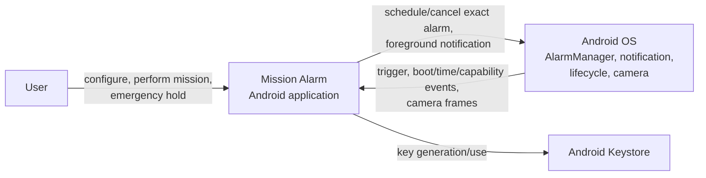
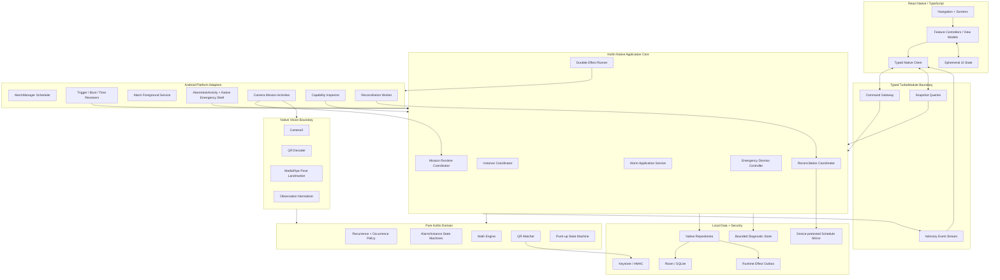
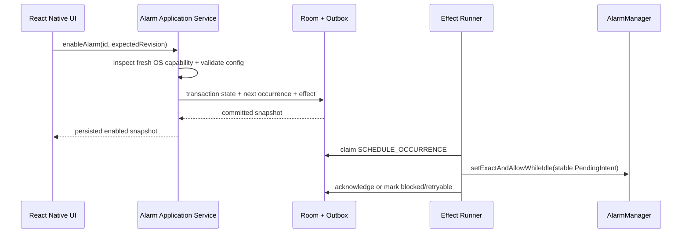
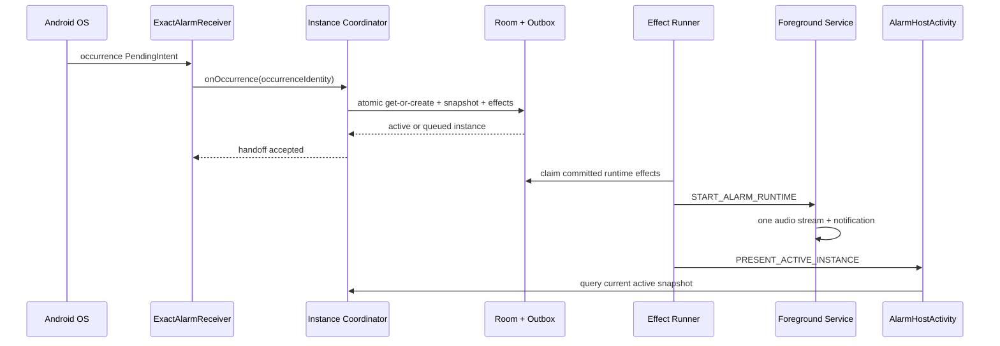
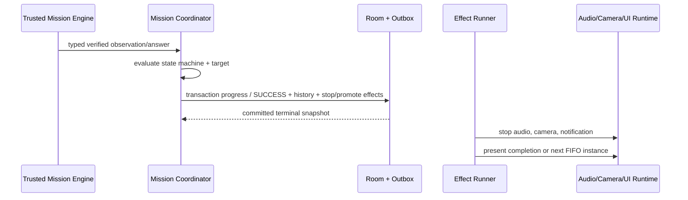
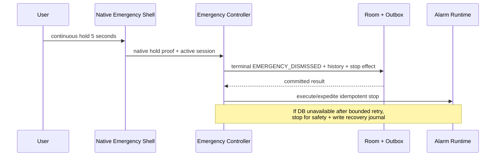

# Mission Alarm — System Architecture

| Field | Value |
|---|---|
| Product | Mission Alarm |
| Document | System Architecture |
| Version | 1.0 |
| Status | Accepted |
| Scope | Android-first MVP |
| Date | 2026-08-28 |
| Product baseline | [`../product/MVP_SCOPE.md`](../product/MVP_SCOPE.md) |
| Technical requirements | [`../requirements/TECHNICAL_REQUIREMENTS.md`](../requirements/TECHNICAL_REQUIREMENTS.md) v1.0 Accepted |
| Feasibility evidence | [`../feasibility/TECHNICAL_FEASIBILITY.md`](../feasibility/TECHNICAL_FEASIBILITY.md) |

## 1. Purpose

Dokumen ini menetapkan struktur runtime dan ownership Mission Alarm Android MVP: komponen, boundary, source of truth, komunikasi React Native–Kotlin, lifecycle background/lock-screen, concurrency, persistence-first effects, failure containment, dan deployment. Detail tabel/kolom serta payload method final tetap menjadi keluaran Fase 6.

## 2. Architecture drivers

Urutan prioritas arsitektur:

1. Tidak ada verification valid berarti tidak ada normal dismissal.
2. User tidak boleh terjebak ketika JavaScript, camera, model, atau persistence mengalami kegagalan.
3. Alarm harus dipicu, dipulihkan, dan dihentikan tanpa bergantung pada React Native runtime atau internet.
4. Duplicate OS callback dan process recreation harus aman.
5. Raw camera frame tidak boleh keluar dari native vision boundary.
6. State yang dapat memengaruhi result harus durable, auditable, dan transactional.
7. React Native tetap digunakan untuk delivery UI yang cepat tanpa menjadi authority core alarm.
8. Kompleksitas distribusi dihindari: MVP tidak memakai backend dan tidak memiliki konflik sync.

## 3. Architecture style

Sistem menggunakan **offline modular monolith** dalam satu Android application process, dengan dua runtime layer:

- **React Native presentation layer** untuk onboarding, home, configuration, history, settings, dan bagian presentasi mission.
- **Kotlin native core** untuk persistence, scheduling, trigger, active-instance orchestration, audio/notification, verification authority, camera pipeline, emergency dismissal, dan reconciliation.

Dependency mengikuti arah:

```text
Presentation -> Application use cases -> Domain -> Repository/port interfaces
                                           ^
                                           |
                          Android/Room/Camera adapters
```

Domain dan application policy tidak boleh bergantung langsung pada React component, Activity, `AlarmManager`, CameraX, MediaPipe, atau detail tabel Room. Adapter mengimplementasikan port yang diperlukan use case.

## 4. System context



Tidak ada backend atau external analytics pada MVP. Internet bukan dependency runtime.

## 5. Container and component view



## 6. Ownership matrix

| Concern | Authoritative owner | Consumer/presenter |
|---|---|---|
| Alarm configuration and enabled state | Native repository + Room | React Native screens |
| Next occurrence | Native recurrence/scheduler coordinator | Home UI, OS `AlarmManager` |
| Occurrence deduplication | Native trigger transaction | Receiver/service |
| Active instance and FIFO queue | Native instance coordinator + Room | Alarm host and RN UI |
| Terminal result/history | Native completion transaction | History UI |
| Audio/notification/lock-screen | Native foreground service and host activity | OS/user |
| Emergency hold and stop | Native emergency shell/controller | RN may explain status only |
| Math question/answer authority | Native Math engine + repository | RN Math UI |
| QR reference/match authority | Native QR matcher + Keystore | Native camera UI/RN config UI |
| Push-up landmarks and rep authority | Native vision + pure Kotlin state machine | Native overlay/RN progress observer |
| Permission truth | Android OS via capability inspector | RN education/recovery UI |
| Ephemeral form/display state | React Native feature state | React components |
| Durable diagnostics | Native bounded diagnostic store | Future explicit export/support UI |

React Native state store tidak boleh menjadi source of truth bagi alarm enabled, active instance, verified progress, result, atau permission status.

## 7. Native application core

### 7.1 Alarm Application Service

Menyediakan use case create/update/delete/enable/disable dan query next alarm. Service:

- Memvalidasi domain configuration.
- Menulis state secara transactional.
- Meminta schedule reconciliation melalui durable effect.
- Tidak memanggil `AlarmManager` dari transaction database.
- Mengembalikan persisted snapshot, bukan optimistic state yang belum durable.

### 7.2 Instance Coordinator

Menjadi single authority untuk:

- Atomic get-or-create berdasarkan occurrence identity.
- Snapshot immutable configuration.
- FIFO promotion.
- State transition dan terminal-result uniqueness.
- Recovery instance aktif setelah cold start/process death.
- Menolak transition yang tidak valid atau stale command.

Setiap mutating command membawa instance ID dan expected revision. Coordinator menyimpan revision monotonic agar late callback tidak menimpa state lebih baru.

### 7.3 Mission Runtime Coordinator

Membuat engine berdasarkan versioned mission snapshot. Coordinator hanya menerima typed evidence:

- `MathAnswerSubmitted(answer)`.
- `QrDigestObserved(digestVersion, digest)` dari trusted native scanner.
- `PushUpObservation(...)` dari native observation normalizer.

Tidak tersedia command publik `completeMission()` atau `setProgress()`. Completion hanya merupakan hasil evaluasi engine dan target.

### 7.4 Emergency Dismiss Controller

Native controller menerima completion dari native 5-second hold UI, memvalidasi active instance, mencatat terminal result, dan menghentikan runtime effects. React Native tidak dapat mengirim arbitrary emergency completion tanpa native gesture proof/token yang scoped ke active host session.

Jika database gagal melewati bounded retry, safety stop tetap dijalankan. Controller menulis minimal recovery journal ke device-protected atomic storage dan menandai result sebagai pending reconciliation; kondisi ini tidak pernah diubah menjadi `SUCCESS`.

### 7.5 Reconciliation Coordinator

Membandingkan desired persisted state dengan actual/observable OS state untuk:

- Enabled alarms dan pending exact schedules.
- One-time disable dan weekly next occurrence.
- Runtime effects yang belum acknowledged.
- Active/queued instance consistency.
- Device-protected schedule mirror.

Reconciliation aman dipanggil berulang saat boot, user unlocked, time/timezone change, package replaced, capability restored, app foreground, dan setelah partial failure.

## 8. Persistence-first effects

Database state dan OS side effects tidak dapat berada dalam satu transaction. Arsitektur memakai **local transactional outbox**:

```text
Database transaction
  1. validate current revision/state
  2. write domain state
  3. append deterministic runtime_effect rows
  4. commit

Effect runner
  5. claim pending effect
  6. invoke OS adapter idempotently
  7. persist acknowledged / retryable / blocked result
```

Contoh effect:

- `SCHEDULE_OCCURRENCE`
- `CANCEL_OCCURRENCE`
- `START_ALARM_RUNTIME`
- `PRESENT_ACTIVE_INSTANCE`
- `STOP_ALARM_RUNTIME`
- `PROMOTE_QUEUED_INSTANCE`
- `SYNC_DIRECT_BOOT_MIRROR`

Effect key bersifat deterministic terhadap aggregate/revision/effect type. Duplicate execution aman karena setiap adapter memiliki stable identity. Permanent capability denial menghasilkan `BLOCKED_CAPABILITY`, bukan retry loop tanpa batas.

## 9. Process, thread, and concurrency model

### 9.1 Process model

MVP menggunakan satu application process. Foreground service menaikkan survivability saat alarm aktif; durable state tetap menjadi recovery source setelah process death. CV tidak ditempatkan pada process terpisah sampai profiling membuktikan kebutuhan isolasi.

### 9.2 Thread ownership

| Work | Execution context |
|---|---|
| Activity/React UI updates | Android main thread |
| Room transaction/repository I/O | Kotlin coroutine `Dispatchers.IO` |
| Aggregate state transition | Serialized per alarm/instance key melalui mutex/actor |
| Trigger receiver | Short `goAsync`/handoff; tidak menjalankan heavy work |
| Durable effect processing | Bounded coroutine worker/foreground runtime |
| Camera frame acquisition | CameraX executor |
| MediaPipe inference | Dedicated native inference executor/callback |
| Push-up state machine | Serialized observation stream, bukan parallel per frame |
| Diagnostic write | Bounded asynchronous queue; drop-safe untuk noncritical event |

Lock tidak boleh dipegang ketika memanggil React Native, Activity navigation, `AlarmManager`, camera, audio, atau notification API. Semua callback eksternal diperlakukan at-least-once dan dapat datang terlambat.

## 10. React Native boundary

### 10.1 Boundary rules

- Satu typed TurboModule facade mengekspos application commands dan snapshot queries.
- Command mengembalikan persisted result atau structured error.
- Native event hanya sinyal invalidation/advisory; setelah menerima event, UI melakukan snapshot query.
- Event loss saat JS belum hidup tidak memengaruhi correctness.
- Identifier, range, revision, dan current state selalu divalidasi ulang di Kotlin.
- Camera frame, bitmap, landmark array berfrekuensi tinggi, raw QR payload, answer key, dan secret tidak melewati bridge.
- Emergency stop dan mission completion tidak bergantung pada event round-trip ke JS.

### 10.2 Conceptual facade

```text
AlarmCommands
  saveDraft(configuration)
  enableAlarm(alarmId, expectedRevision)
  disableAlarm(alarmId, expectedRevision)
  deleteAlarm(alarmId, expectedRevision)

RuntimeCommands
  startMission(instanceId)
  submitMathAnswer(instanceId, expectedRevision, answer)
  retryCapability(instanceId, capability)

Queries
  getHomeSnapshot()
  getAlarmEditorSnapshot(alarmId?)
  getActiveRuntimeSnapshot()
  getHistoryPage(cursor)

Events
  alarmDataChanged
  activeRuntimeChanged
  capabilityChanged
```

Nama, payload, error code, pagination, dan versioning final ditetapkan pada API Contract Fase 6.

## 11. Android component model

| Component | Exported | Responsibility |
|---|---:|---|
| `MainActivity` | launcher only | Standard React Native application navigation |
| `AlarmHostActivity` | No | Show-when-locked/turn-screen-on host, native emergency shell, RN recovery/presentation container |
| `PushUpMissionActivity` | No | CameraX + pose UI and native emergency shell |
| `QrMissionActivity` | No | CameraX + QR UI and native emergency shell |
| `ExactAlarmReceiver` | No; explicit PendingIntent | Minimal occurrence handoff to instance coordinator/service |
| `SystemReconcileReceiver` | Only OS-required actions | Validate action and enqueue reconciliation for boot/time/timezone/package/user-unlocked events |
| `AlarmForegroundService` | No | Single alarm audio stream, foreground notification, wake/runtime ownership |
| `ReconciliationWorker` | N/A | Retry bounded scheduling/outbox/reconciliation work under OS rules |
| Typed TurboModule | App-local | Validated RN/native command-query boundary |

Full-screen notification membuka `AlarmHostActivity` dengan instance ID yang divalidasi terhadap database; intent extra tidak menjadi authority.

## 12. Core runtime flows

### 12.1 Enable or edit alarm



UI menampilkan enabled/healthy hanya jika persisted scheduling status sesuai. Gagal OS scheduling menghasilkan recoverable warning.

### 12.2 Alarm trigger



Jika callback identik datang lagi, unique constraint mengembalikan instance yang sama dan duplicate start effect disupresi.

### 12.3 Verified mission completion



UI tidak dapat membuat `SUCCESS`; UI hanya menampilkan snapshot yang telah committed.

### 12.4 Emergency dismissal



### 12.5 Boot/direct-boot reconciliation

Device-protected schedule mirror adalah derived store, bukan primary database:

```text
LOCKED_BOOT_COMPLETED
    -> read minimal schedule mirror
    -> restore upcoming OS exact alarms
    -> if occurrence fires before unlock: ring with minimal snapshot,
       journal trigger/result, require unlock for full mission state

USER_UNLOCKED / normal BOOT_COMPLETED
    -> open Room
    -> import journal idempotently
    -> reconcile mirror and AlarmManager from Room source of truth
```

Mirror tidak menyimpan raw QR payload, QR secret, history, camera data, atau Math answer key. Detail field dan encryption ditetapkan pada Fase 6.

## 13. Mission component architecture

### 13.1 Common contract

```text
MissionEngine<C, E, S>
  initialize(versionedSnapshot): S
  evaluate(currentState: S, evidence: E): Transition<S>
  progress(state: S): Progress
  isComplete(state: S): Boolean
```

Engine harus pure/deterministic. Coordinator menangani persistence dan effects; engine tidak mengakses Room, UI, clock global, camera, atau network.

### 13.2 Push-up pipeline

```text
CameraX ImageProxy
  -> rotation/mirroring adapter
  -> MediaPipe Pose Landmarker
  -> landmark visibility + side selection
  -> normalized pose observation
  -> angle/alignment features
  -> PushUpStateMachine
  -> committed rep progress
```

Backpressure `KEEP_ONLY_LATEST`; hanya satu inference aktif per mission session. Result yang datang setelah session token berubah dibuang. Camera lifecycle terikat ke native mission activity, sedangkan committed rep state berada di repository.

### 13.3 QR pipeline

```text
CameraX ImageProxy
  -> QR Decoder Adapter
  -> normalized payload in memory
  -> HMAC using Keystore key
  -> constant-time digest compare
  -> one-shot verified evidence
```

Raw payload dihapus dari reference secepat praktis dan tidak masuk log/history. Decoder library berada di belakang adapter agar dapat diganti tanpa mengubah mission domain.

### 13.4 Math pipeline

Native deterministic generator membuat question set sebelum presentasi. RN menampilkan question dan mengirim answer; native engine memvalidasi terhadap persisted question state. Answer key tidak dikirim sebagai bagian snapshot UI.

## 14. Data architecture

### 14.1 Aggregate boundaries

| Aggregate | Owns | Key invariant |
|---|---|---|
| Alarm | Configuration, enabled state, revision, recurrence | Enabled hanya dengan valid mission/capability |
| Occurrence | Scheduled instant, identity, scheduling status | Unique alarm + instant |
| Alarm Instance | Snapshot, runtime state, queue order, terminal result | One terminal result |
| Mission Runtime | Versioned state/progress/evidence summary | Progress monotonic; no manual completion |
| History Record | Immutable terminal snapshot | Tidak berubah karena alarm edit/delete |
| Runtime Effect | Desired OS side effect, status, attempt | Deterministic/idempotent key |

### 14.2 Repository rules

- Room diakses hanya melalui native repositories/application services.
- React Native tidak membuka SQLite connection sendiri.
- Entity Room tidak melewati bridge; mapper menghasilkan versioned DTO snapshot.
- Foreign key, unique constraint, check constraint bila didukung, dan transaction menjaga invariants bersama application validation.
- Query UI read-only boleh asynchronous; critical command tidak menggunakan stale cached entity.
- Migration bersifat forward-only dan diuji dari setiap production version.

## 15. Capability and permission architecture

`CapabilityInspector` membaca status segar dari OS dan menghasilkan domain capability snapshot:

- Exact alarm access.
- Notification permission/channel availability.
- Full-screen intent access.
- Camera permission/hardware availability.
- Battery optimization/restriction information yang dapat dideteksi.

`CapabilityPolicy` menentukan apakah action `save draft`, `enable`, `schedule`, atau `start mission` boleh dilakukan dan recovery route apa yang ditampilkan. RN tidak menginterpretasikan raw OS flags secara independen.

## 16. Failure containment and recovery

| Failure | Containment | Recovery |
|---|---|---|
| React Native bundle/context gagal | Native alarm host, audio, persisted state, dan emergency shell tetap hidup | Recreate RN; tampilkan native recovery UI jika gagal |
| Duplicate trigger/callback | Unique occurrence + deterministic effect key | Return existing instance; log suppression |
| Process killed | Durable state/outbox | OS/service/app relaunch menjalankan reconciliation |
| Room write gagal | Jangan emit success; command gagal terstruktur | Retry bounded; emergency uses safety journal |
| AlarmManager call gagal | Persist effect blocked/retryable | Capability education atau reconciliation retry |
| Full-screen access tidak ada | Foreground notification tetap menjadi route | User membuka instance yang sama dari notification |
| Notification denied | Audio/service mengikuti kemampuan OS; status tidak diklaim sehat | Recovery screen menuju Settings; device-specific validation |
| Audio resource/MediaPlayer gagal | Mission/recovery UI tidak crash | Fallback built-in sound/vibration bila tersedia; diagnostic reason |
| Camera permission/hardware gagal | Instance → `RECOVERY_REQUIRED`; no progress | Retry/settings; emergency remains native |
| MediaPipe init/inference error | Close analyzer safely; no progress | Reinitialize bounded; fallback recovery/emergency |
| Body/QR tidak terdeteksi | Tidak mengubah committed progress | Actionable guidance dan retry continuous |
| Late camera callback | Session token/revision mismatch | Drop result |
| Keystore key invalidated | QR match tidak dapat dipercaya | Require QR re-registration for future alarm; active instance recovery/emergency |
| Corrupt/incompatible state | No automatic success | Quarantine/sanitized diagnostic, mission-locked safe state, emergency |

## 17. Security and privacy boundaries

- Semua Android component non-exported secara default.
- OS-exported reconciliation receiver menerima allowlisted system action saja.
- PendingIntent explicit dan immutable.
- Native bridge dianggap input boundary; semua command divalidasi.
- HMAC key dibuat dan digunakan dalam Keystore; key bytes tidak keluar.
- Release build tidak memiliki debug/test stop action.
- Camera image, pose landmark stream, QR payload, dan Math answer key tidak masuk event/log.
- Device-protected mirror berisi minimum non-secret schedule material.
- Backup exclusions menjaga agar derived mirror, CV cache, dan Keystore-dependent value tidak dipulihkan secara tidak konsisten.

Threat model rinci dan schema-level controls diselesaikan pada Fase 6/8.

## 18. Diagnostics architecture

Native `DiagnosticRecorder` menerima allowlisted event dan reason code. Event disimpan dalam bounded ring/retention store dan tidak berada pada critical transaction path kecuali correlation ID/reason minimum yang menjadi bagian audit result.

Correlation hierarchy:

```text
alarmId
  -> occurrenceId
      -> instanceId
          -> missionSessionId
              -> effectId / diagnosticEventId
```

Wall-clock digunakan untuk audit/user display; monotonic clock digunakan untuk duration dan trigger/performance measurement dalam satu boot session.

## 19. Deployment and source-module proposal

```text
src/
  app/                    # RN bootstrap, navigation, shared UI
  features/
    alarms/               # list/editor presentation
    active-alarm/         # RN portion of runtime UI
    math-mission/         # math presentation only
    history/
    permissions/
  native/                 # typed TS facade/specs

android/app/src/main/java/.../
  alarm/
    domain/               # recurrence and state policies
    application/          # use cases/coordinators
    platform/             # receivers, scheduler, FGS, notification
  mission/
    core/
    pushup/
    math/
    qr/
  data/
    db/                   # Room, DAO, migrations
    repository/
    effects/
    directboot/
  bridge/                 # TurboModule implementation and DTO mapping
  ui/                     # AlarmHostActivity, native emergency shell
  capability/
  security/
  diagnostics/
```

Package detail dapat disesuaikan saat scaffolding, tetapi dependency direction dan ownership boundary tidak boleh dibalik.

## 20. Architecture requirement mapping

| TRS concern | Architecture mechanism |
|---|---|
| TR-INV-001–010 | Native authority, pure mission engines, transactional state + outbox, native terminal cleanup |
| TR-ALM-001–014 | Alarm Application Service, recurrence domain, AlarmManager adapter, reconciliation |
| TR-INS-001–012 | Instance Coordinator, Room source of truth, FGS, AlarmHostActivity |
| TR-OVR-001–006 | Persisted FIFO queue and single runtime coordinator/audio stream |
| TR-MIS-001–008 | Mission Runtime Coordinator and no public completion command |
| TR-PUP-001–012 | Native vision boundary and pure PushUpStateMachine |
| TR-MAT-001–008 | Native generator/validator with persisted versioned question state |
| TR-QR-001–007 | Native decoder adapter, Keystore HMAC, exact digest matcher |
| TR-EMG-001–007 | Native emergency shell/controller and safety recovery journal |
| TR-PER-001–008 | CapabilityInspector + CapabilityPolicy + reconciliation |
| TR-DAT-001–010 | Room-only native repositories, aggregates, transactions, migrations, direct-boot derived mirror |
| TR-SEC/PRV | Export boundary hardening, bridge validation, Keystore, in-memory camera/QR pipeline |
| TR-REL/PFM | Persistent effects, serialized coordinators, native performance path, diagnostics clocks |
| TR-ACC | RN/native UI contract plus native accessible emergency shell |
| TR-OBS | Bounded structured native diagnostic recorder |
| TR-QLT | Pure domain modules, replaceable adapters, testable use cases, device seams |

## 21. Accepted architecture decision record

Seluruh keputusan berikut disetujui product owner pada 2026-08-28.

| ID | Accepted decision | Rationale/trade-off |
|---|---|---|
| ADR-001 | Kotlin native core owns all durable state and completion authority; RN is presentation/client. | Reliable without JS; more native implementation work. |
| ADR-002 | Room/SQLite is accessed only through native repositories. | Satu writer model dan receiver/service access; bridge queries must be designed well. |
| ADR-003 | MVP uses one Android application process. | Simpler lifecycle/data consistency; CV crash isolation relies on recovery rather than separate process. |
| ADR-004 | Dedicated native `AlarmHostActivity` provides lock-screen hosting and native emergency shell around RN content. | Prevents trapped alarm when JS fails; adds native/RN host integration. |
| ADR-005 | Critical OS actions use transactional outbox + idempotent effect runner. | Strong crash/duplicate recovery; adds effect state and reconciliation complexity. |
| ADR-006 | TurboModule events are advisory invalidations; UI always re-queries persisted snapshot. | Tolerates event loss/restart; slightly more local query traffic. |
| ADR-007 | Mission engines are pure Kotlin; no bridge command can directly set progress or completion. | Preserves verification trust boundary; some shared logic cannot live only in TypeScript. |
| ADR-008 | Support pre-unlock alarm restoration via minimal device-protected schedule mirror and recovery journal. | Better reboot reliability; introduces carefully controlled derived storage. |
| ADR-009 | Camera/MediaPipe/QR decoding stays behind native adapters in the same process. | Lowest latency and no frame bridge; separate-process isolation deferred unless profiling requires it. |

## 22. Architecture fitness checks

Implementation must menyediakan automated atau reviewable checks berikut:

1. React Native source tidak mengakses SQLite atau Android scheduling API langsung.
2. Tidak ada bridge method `completeMission`, `setProgress`, atau equivalent authority bypass.
3. Domain tests dapat berjalan di JVM tanpa Android/Room/MediaPipe.
4. Duplicate occurrence dan duplicate effect injection menghasilkan satu instance/result/runtime effect.
5. RN context failure tetap menyisakan native emergency hold yang berfungsi.
6. Camera result setelah session closed tidak mengubah progress.
7. Release manifest hanya mengekspor component yang diperlukan dan semua intent divalidasi.
8. Camera/QR/landmark data tidak muncul di persisted store atau log inspection.
9. Process-death test memulihkan active instance dari Room/outbox.
10. Direct-boot mirror dapat direbuild penuh dari Room setelah unlock.

## 23. Fase 4 acceptance gates

Fase 4 dapat menjadi `Accepted` jika:

- ADR-001–009 disetujui atau direvisi.
- Setiap critical requirement Fase 3 memiliki owning component dan recovery path.
- Source of truth, transaction boundary, side-effect model, concurrency, dan bridge trust boundary tidak ambigu.
- Arsitektur tidak memperkenalkan backend, multiple mission, snooze, atau scope post-MVP.
- Open detail tersisa dapat diselesaikan oleh CV Specification dan Database/API Contract tanpa mengubah fundamental runtime ownership.

## 24. Deferred details

- Final CV thresholds/model benchmark: Fase 5.
- Entity/table/column/index, direct-boot mirror fields, outbox schema: Fase 6.
- Exact TurboModule payload, error code, event schema, pagination: Fase 6.
- Screen composition/copy/native-RN visual integration: Fase 7.
- Test harness, fault injection, coverage threshold, device execution matrix: Fase 8.
- Module scaffolding order and delivery milestones: Fase 9.
