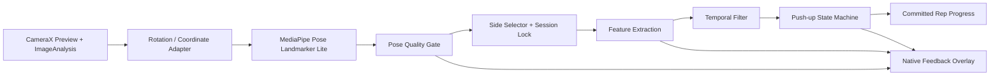
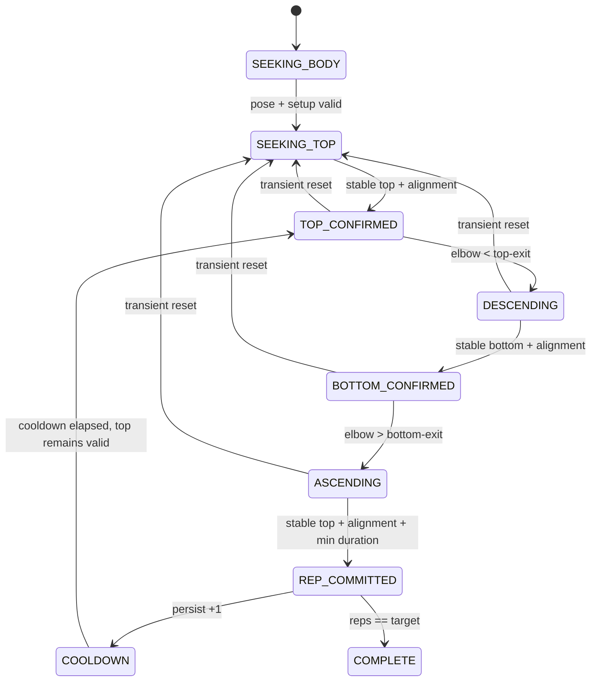

# Mission Alarm — Computer Vision & Exercise Detection Specification

| Field | Value |
|---|---|
| Product | Mission Alarm |
| Document | Computer Vision & Exercise Detection Specification |
| Version | 1.0 |
| Status | Specification Accepted — Model Qualification Pending |
| Scope | Android MVP: Push-up verification; QR camera boundary |
| Date | 2026-08-28 |
| Product baseline | [`../product/MVP_SCOPE.md`](../product/MVP_SCOPE.md) |
| Technical requirements | [`../requirements/TECHNICAL_REQUIREMENTS.md`](../requirements/TECHNICAL_REQUIREMENTS.md) v1.0 Accepted |
| System architecture | [`../architecture/SYSTEM_ARCHITECTURE.md`](../architecture/SYSTEM_ARCHITECTURE.md) v1.0 Accepted |
| Feasibility spike | [`../../spikes/mobile-feasibility`](../../spikes/mobile-feasibility) |

## 1. Purpose

Dokumen ini menetapkan pipeline, input contract, pose features, state machine, quality gates, feedback, versioning, privacy, dataset, metrics, dan qualification procedure untuk memverifikasi push-up secara on-device.

Spesifikasi dibagi menjadi:

- **Normative design**: boundary dan perilaku yang harus dipertahankan.
- **Provisional threshold profile**: angka awal yang boleh digunakan untuk implementasi/test harness, tetapi belum menjadi klaim akurasi sampai lulus dataset manusia dan physical-device benchmark.

## 2. Objective and non-goals

### 2.1 Objective

Sistem harus menghitung tepat satu repetisi ketika kamera mengamati satu urutan push-up yang valid:

```text
valid top -> valid descent -> valid bottom -> valid ascent -> valid top -> +1 rep
```

Sistem harus lebih memprioritaskan pencegahan false positive daripada menghitung semua gerakan yang ambigu. False negative tetap harus dikendalikan agar mission dapat diselesaikan dalam setup yang didukung.

### 2.2 Non-goals

- Diagnosis kesehatan, penilaian kebugaran, coaching klinis, atau pengukuran biomekanik presisi.
- Identifikasi user, face recognition, biometric template, atau age/body-type inference.
- Liveness detection atau jaminan anti-replay terhadap video orang melakukan push-up.
- Verifikasi push-up dari sudut kamera frontal, overhead, handheld, atau kamera yang bergerak.
- Multi-person tracking.
- Squat, Plank, atau exercise lain.
- Training/fine-tuning model pada perangkat user.

## 3. Supported operating envelope

Detection dinyatakan supported hanya bila:

| Dimension | Supported baseline |
|---|---|
| Device | Android API 24+, front camera tersedia |
| Orientation | Landscape; device stabil pada permukaan/stand |
| View | Side view, satu orang, seluruh tubuh termasuk wrist dan ankle terlihat |
| Distance | Diatur sampai body bounding box memenuhi framing gate; tidak memakai jarak meter tetap |
| Lighting | Tubuh dan sendi terlihat; tidak backlit ekstrem atau terlalu gelap |
| Exercise | Floor push-up standar dengan tangan dan kaki/lutut dalam frame sesuai supported variant |
| Clothing/environment | Landmark utama tidak tertutup; background cukup berbeda untuk model mendeteksi pose |
| Network | Tidak diperlukan |

MVP baseline memverifikasi **standard toe push-up**. Knee push-up, incline push-up, wall push-up, dan assistive variant tidak dianggap valid sampai memiliki profile dan validation dataset sendiri.

## 4. End-to-end pipeline



Hanya `Committed Rep Progress`, detector/profile version, dan sanitized reason summary yang boleh masuk durable mission state. Frame, bitmap, landmark stream, dan transient angle history tidak dipersist.

## 5. Runtime and model profile

### 5.1 Baseline model

| Field | Baseline |
|---|---|
| Runtime | MediaPipe Tasks Vision 1.0.0, version pinned |
| Task | Pose Landmarker |
| Model | Pose Landmarker Lite, float16 |
| Asset | `pose_landmarker_lite.task` |
| Asset SHA-256 | `59929e1d1ee95287735ddd833b19cf4ac46d29bc7afddbbf6753c459690d574a` |
| Delegate | CPU baseline |
| Running mode | `LIVE_STREAM` |
| Number of poses | 1 |
| Segmentation mask | Disabled |
| Detection confidence | 0.50 provisional runtime filter |
| Pose presence confidence | 0.50 provisional runtime filter |
| Tracking confidence | 0.50 provisional runtime filter |

MediaPipe Pose Landmarker menghasilkan 33 landmarks dalam normalized image coordinates dan world coordinates. LIVE_STREAM memakai asynchronous result listener dan timestamp input yang meningkat. Konfigurasi resmi menyediakan detection, presence, tracking confidence, number of poses, dan optional segmentation mask; spesifikasi ini mengunci pilihan MVP agar reproducible.

### 5.2 Model selection policy

Lite tetap baseline jika seluruh accuracy dan performance gate lulus. Perbandingan dengan Full dilakukan hanya jika:

- Lite gagal precision/recall/condition robustness; atau
- perangkat kelas menengah memiliki performance headroom yang cukup.

Heavy tidak masuk kandidat MVP kecuali Lite dan Full keduanya gagal accuracy gate dan Heavy masih memenuhi seluruh latency/thermal requirement. Perubahan model harus menghasilkan model/profile version baru dan full regression dataset.

## 6. Camera acquisition specification

| ID | Requirement |
|---|---|
| CV-CAM-001 | `PushUpMissionActivity` harus meminta landscape orientation dan menampilkan side-view setup guidance sebelum counting. |
| CV-CAM-002 | Front camera adalah default; preview boleh mirrored untuk user, tetapi analysis coordinates harus memiliki canonical unmirrored orientation. |
| CV-CAM-003 | `Preview` dan `ImageAnalysis` harus di-bind ke activity lifecycle dalam satu CameraX session. |
| CV-CAM-004 | ImageAnalysis harus memakai `STRATEGY_KEEP_ONLY_LATEST`; frame tidak boleh membentuk backlog. |
| CV-CAM-005 | Preferred analysis stream adalah closest-supported 16:9 sekitar 1280×720; fallback minimum sekitar 640×480 diperbolehkan dan harus dicatat dalam benchmark. |
| CV-CAM-006 | Pipeline menargetkan submission 20 FPS dan boleh beradaptasi turun ke 15 FPS ketika inference sibuk. Qualification gagal bila median processed FPS perangkat kelas menengah <15. |
| CV-CAM-007 | Maksimal satu inference boleh in-flight per mission session. Frame ketika inference slot sibuk harus dibuang. |
| CV-CAM-008 | Setiap `ImageProxy` harus ditutup tepat sekali pada success, error, stale session, dan exception path. |
| CV-CAM-009 | Timestamp inference harus berasal dari monotonic clock, strictly increasing dalam satu session. Out-of-order result harus dibuang. |
| CV-CAM-010 | Rotation metadata harus diterapkan sebelum feature calculation; aspect ratio input aktual harus disertakan dalam observation. |
| CV-CAM-011 | Session token harus berubah saat activity/retry/model restart. Callback dengan token lama tidak boleh mengubah state. |
| CV-CAM-012 | Analyzer, camera provider, dan model harus ditutup/unbound saat mission terminal atau activity tidak lagi melakukan verification. |

## 7. Coordinate systems

### 7.1 Canonical image coordinates

MediaPipe normalized coordinate dikonversi ke aspect-corrected coordinate:

```text
X = landmark.x * inputWidth
Y = landmark.y * inputHeight
```

Semua 2D angle dan distance ratio dihitung setelah rotation correction dalam coordinate input, bukan langsung pada normalized `x/y` yang memiliki skala sumbu berbeda.

Preview overlay memiliki transform terpisah:

```text
canonical analysis coordinates
    -> crop/scale transform
    -> optional front-camera mirror
    -> preview coordinates
```

Overlay transform tidak boleh digunakan kembali untuk verification features.

### 7.2 World coordinates

World landmark boleh digunakan untuk side-on/yaw quality proxy dan offline analysis. MVP v1 tidak menggunakan absolute world distance sebagai range-of-motion criterion karena nilainya model-derived dan perlu validasi lintas device/body.

## 8. Required landmarks

MediaPipe indices yang digunakan:

| Joint | Left | Right | Purpose |
|---|---:|---:|---|
| Shoulder | 11 | 12 | Elbow angle, torso, side orientation |
| Elbow | 13 | 14 | Primary range-of-motion vertex |
| Wrist | 15 | 16 | Elbow angle, framing |
| Hip | 23 | 24 | Body alignment and torso |
| Knee | 25 | 26 | Knee extension/anti-knee-push-up gate |
| Ankle | 27 | 28 | Body line and full-body framing |

Nose may digunakan hanya untuk setup feedback; face landmarks tidak diperlukan untuk counting.

## 9. Pose quality gates

Setiap result menghasilkan `PoseQuality` sebelum feature/state evaluation.

### 9.1 Per-side quality

Untuk side `s`, critical set:

```text
shoulder[s], elbow[s], wrist[s], hip[s], knee[s], ankle[s]
```

Side valid jika seluruh critical landmarks:

- Visibility ≥ `0.60` provisional.
- Presence, jika tersedia pada API result, ≥ `0.60` provisional.
- Berada dalam safe image bounds `[-0.02, 1.02]`; counting membutuhkan framing gate yang lebih ketat.

`sideQuality` adalah minimum critical visibility, bukan average, agar satu sendi tersembunyi tidak ditutupi oleh landmark lain yang sangat yakin.

### 9.2 Framing gate

Counting hanya aktif bila:

- Shoulder, wrist, hip, knee, dan ankle side terpilih berada dalam bounds `[0.02, 0.98]`.
- Projected shoulder-to-ankle length minimal 35% dari diagonal frame.
- Body bounding extent tidak melewati 95% width/height frame.
- Body tetap terdeteksi memenuhi gate selama minimum 300 ms dan minimal 4 processed results.

### 9.3 Side-on gate

User harus menghadap samping. Provisional yaw proxy memakai world-coordinate shoulder dan hip pairs:

```text
shoulderDepthDominance = abs(zLeftShoulder - zRightShoulder)
                         / distance3D(leftShoulder, rightShoulder)

hipDepthDominance = abs(zLeftHip - zRightHip)
                    / distance3D(leftHip, rightHip)

sideOnScore = median(shoulderDepthDominance, hipDepthDominance)
```

Counting membutuhkan `sideOnScore ≥ 0.60` provisional selama 300 ms. Jika world coordinates tidak valid, system menampilkan `TURN_SIDEWAYS` dan tidak menghitung; 2D-only fallback untuk counting tidak diizinkan sebelum dataset membuktikannya.

### 9.4 Lighting gate

Analyzer menghitung downsampled mean luma tanpa menyimpan image. `LOW_LIGHT` dipicu bila rolling median luma <35/255 selama ≥500 ms. Nilai ini hanya feedback gate provisional dan harus divalidasi lintas camera exposure; detector confidence tetap menjadi authority apakah landmark layak dipakai.

## 10. Side selection and locking

1. Saat `SEEKING_TOP`, pilih side valid dengan `sideQuality` tertinggi.
2. Selisih quality <0.05 mempertahankan pilihan sebelumnya untuk menghindari oscillation.
3. Setelah top dikonfirmasi, side dikunci sampai rep committed atau transient cycle di-reset.
4. Hilangnya selected side tidak boleh membuat engine pindah side di tengah rep.
5. Side boleh dipilih ulang hanya setelah kembali ke `SEEKING_TOP` dan quality gate stabil.

## 11. Feature definitions

### 11.1 Generic joint angle

Untuk titik aspect-corrected `A`, `B`, `C`, angle pada `B`:

```text
u = A - B
v = C - B
angle(A,B,C) = degrees(acos(clamp(dot(u,v) / (|u||v|), -1, 1)))
```

Jika panjang vector di bawah epsilon, observation invalid.

### 11.2 Primary features

| Feature | Definition | Purpose |
|---|---|---|
| `elbowAngle` | angle(shoulder, elbow, wrist) | Top/bottom range of motion |
| `hipAlignmentAngle` | angle(shoulder, hip, ankle) | Straight body line |
| `kneeAngle` | angle(hip, knee, ankle) | Reject bent-knee/knee push-up baseline |
| `bodyTilt` | absolute angle shoulder→ankle terhadap horizontal axis, folded to 0–90° | Reject standing/vertical arm motion |
| `bodyScale` | shoulder-to-ankle length / frame diagonal | Framing/distance |
| `verticalTravel` | elbow/shoulder trajectory relative to wrist and body scale | Dataset diagnostic; not initial completion authority |
| `sideOnScore` | depth-dominance proxy from Section 9.3 | Supported viewpoint gate |

### 11.3 Alignment validity

Provisional `alignmentValid`:

```text
hipAlignmentAngle >= 150°
AND kneeAngle >= 155°
AND bodyTilt <= 35°
```

Alignment harus valid pada top dan bottom confirmation. Saat transisi, kegagalan alignment membekukan state dan memberi feedback; tidak langsung menghapus committed reps.

## 12. Temporal filtering

| Stage | Rule |
|---|---|
| Landmark smoothing | EMA per selected-side 2D landmark, `alpha=0.45` provisional, hanya pada valid observation |
| Angle spike rejection | Median dari 3 angle samples terbaru |
| Filter reset | Gap result >300 ms, selected side change, rotation/session change |
| Stable top | Condition benar ≥250 ms dan ≥3 valid results |
| Stable bottom | Condition benar ≥150 ms dan ≥2 valid results |
| Quality debounce | Quality failure ≥250 ms sebelum feedback/state freeze, kecuali camera/model error |
| Lost-body reset | Invalid/missing pose ≥750 ms mereset transient rep ke `SEEKING_TOP` |
| Feedback update | Maksimal 4 perubahan per detik; pesan baru harus stabil ≥250 ms kecuali critical error |

Filtering tidak pernah mengubah result low-confidence menjadi valid. Filter hanya mengurangi jitter pada observation yang telah lulus quality gate.

## 13. Provisional threshold profile v0

| Parameter | Value | Status |
|---|---:|---|
| Critical landmark visibility/presence | ≥0.60 | Provisional |
| Side-on score | ≥0.60 | Provisional |
| Top enter elbow angle | ≥155° | Provisional |
| Top exit/descent angle | <145° | Provisional |
| Bottom enter elbow angle | ≤95° | Provisional |
| Bottom exit/ascent angle | >110° | Provisional |
| Hip alignment | ≥150° | Provisional |
| Knee angle | ≥155° | Provisional |
| Body tilt from horizontal | ≤35° | Provisional |
| Stable top | ≥250 ms and ≥3 results | Provisional |
| Stable bottom | ≥150 ms and ≥2 results | Provisional |
| Minimum full rep duration | ≥700 ms | Provisional |
| Post-commit cooldown | ≥300 ms | Provisional |
| Lost-body transient reset | ≥750 ms | Provisional |

Angka Fase 2 (`top 150°`, `down 95°`, visibility `0.60`, alignment `150°`) digunakan sebagai seed saja. Profile v0 menaikkan top threshold dan menambahkan hysteresis, knee, side-on, horizontal-body, dan temporal gates untuk mengurangi arm-only serta double count. Tidak satu pun angka dianggap final sebelum Section 23 lulus.

## 14. Push-up state machine

### 14.1 States



`TEMPORARILY_LOST` dapat menjadi implementation substate/flag; secara domain, setelah timeout transient cycle kembali ke `SEEKING_TOP`.

### 14.2 Transition rules

| From | To | Required condition |
|---|---|---|
| `SEEKING_BODY` | `SEEKING_TOP` | Framing, side-on, selected side, and quality stable |
| `SEEKING_TOP` | `TOP_CONFIRMED` | Elbow ≥155°, alignment valid, stable-top window |
| `TOP_CONFIRMED` | `DESCENDING` | Same side; elbow <145°; quality valid |
| `DESCENDING` | `BOTTOM_CONFIRMED` | Elbow ≤95°, alignment valid, stable-bottom window |
| `BOTTOM_CONFIRMED` | `ASCENDING` | Elbow >110°; same side; quality valid |
| `ASCENDING` | `REP_COMMITTED` | Elbow ≥155°, alignment valid, stable-top, elapsed from first top ≥700 ms |
| `REP_COMMITTED` | `COMPLETE` | Atomic committed reps equals target |

Direct `SEEKING_TOP -> BOTTOM -> TOP`, `TOP -> partial -> TOP`, or state change during invalid quality tidak dihitung.

### 14.3 Persistence and recovery

- Hanya `committedReps`, target, detector/profile version, dan sanitized last feedback/recovery reason dipersist.
- Transient position/filter/half-rep tidak dipulihkan setelah process/activity recreation.
- Recovery mempertahankan `committedReps` dan kembali ke `SEEKING_BODY/SEEKING_TOP`.
- `REP_COMMITTED` harus menggunakan instance revision/idempotency key agar duplicate callback tidak menambah rep dua kali.
- Ketika committed reps mencapai target, mission completion dan final rep berada dalam satu transaction.

## 15. Observation contract

Conceptual pure-Kotlin input:

```text
PushUpObservation
  sessionId
  frameSequence
  monotonicTimestampMs
  inputWidth / inputHeight / rotation
  selectedSide
  poseQuality
  elbowAngle
  hipAlignmentAngle
  kneeAngle
  bodyTilt
  bodyScale
  sideOnScore
```

State machine tidak menerima `Bitmap`, MediaPipe result object, Activity, atau wall-clock global. Contract final dan serialization fixture ditetapkan bersama API/Testing phase; runtime observation tidak melewati React Native bridge.

## 16. Feedback specification

Feedback dipilih berdasarkan priority tertinggi dan harus actionable:

| Priority | Code | User action |
|---:|---|---|
| 1 | `CAMERA_ERROR` | Periksa kamera / coba lagi / emergency tersedia |
| 2 | `PERMISSION_REQUIRED` | Berikan akses kamera atau buka Settings |
| 3 | `BODY_NOT_DETECTED` | Masuk ke frame |
| 4 | `FULL_BODY_REQUIRED` | Mundur/atur ponsel agar wrist–ankle terlihat |
| 5 | `TURN_SIDEWAYS` | Hadapkan sisi tubuh ke kamera |
| 6 | `LOW_LIGHT` | Tambah pencahayaan/hindari backlight |
| 7 | `STRAIGHTEN_BODY` | Luruskan pinggul dan lutut |
| 8 | `FIND_TOP_POSITION` | Luruskan lengan untuk mulai |
| 9 | `LOWER_BODY` | Turunkan tubuh lebih jauh |
| 10 | `PUSH_UP` | Kembali ke posisi atas |
| 11 | `REP_COUNTED` | Rep berhasil; tampilkan progress |
| 12 | `MISSION_COMPLETE` | Target tercapai |

Rules:

- Pesan maksimal satu instruksi utama pada satu waktu.
- Visual feedback selalu tersedia; audio/haptic tidak menjadi satu-satunya channel.
- Audio cue noncritical tidak boleh diulang lebih sering dari sekali per 2 detik.
- Raw confidence/angle tidak ditampilkan pada production UI.
- Debug overlay angle/landmark hanya tersedia pada internal non-release build.

## 17. Recovery and failure behavior

| Condition | State/progress behavior | Recovery |
|---|---|---|
| Pose hilang <750 ms | Freeze transient state; committed reps unchanged | Continue if same session/side returns safely |
| Pose hilang ≥750 ms | Discard half-rep; return `SEEKING_TOP` | Re-frame; committed reps unchanged |
| Selected landmarks low confidence | No state mutation | Guidance; wait for valid observations |
| Camera interrupted | Persist committed reps; close pipeline | Rebind with new session token |
| Model initialization error | No progress; `RECOVERY_REQUIRED` | One bounded reinitialize, then retry/emergency |
| Inference callback error | Close affected frame, no progress | Continue if isolated; escalate after bounded consecutive errors |
| Thermal/performance degraded | Keep latest-frame policy; no relaxed accuracy gate | Warn/restart if unusable; emergency remains available |
| App/process recreation | Transient state discarded | Restore committed reps; start setup again |
| Target reached | Persist final rep + completion atomically | Stop camera immediately |

## 18. Anti-cheat scope and limitations

### 18.1 Implemented defenses

- Tidak ada manual progress/completion control.
- Full movement sequence, range, alignment, knee, side-on, horizontal-body, timing, hysteresis, dan confidence gates.
- Selected side dikunci per rep.
- Duplicate/stale frame and callback suppression.
- Rep commit idempotency.

### 18.2 Explicit limitations

MVP memverifikasi **pose yang terlihat kamera**, bukan identitas atau liveness user. Sistem tidak menjamin mencegah:

- Video replay orang melakukan push-up.
- Orang lain melakukan mission.
- Sophisticated camera injection/rooted-device manipulation.
- Gerakan yang menyerupai push-up tetapi berada di luar distribution dataset.

Keterbatasan ini tidak boleh dipasarkan sebagai tamper-proof anti-cheat. Liveness/identity menambah privacy dan complexity yang berada di luar scope MVP.

## 19. QR camera boundary

QR mission menggunakan CameraX lifecycle/backpressure/privacy rules yang sama, tetapi **tidak** menggunakan pose model/state machine.

```text
ImageProxy -> QR Decoder Adapter -> payload in memory
           -> versioned normalization -> Keystore HMAC
           -> constant-time digest match -> one-shot verified evidence
```

- Decoder harus berfungsi offline.
- Raw payload/frame tidak dipersist atau dicatat.
- Duplicate decode dalam satu session disupresi.
- Match result dikirim langsung ke native Mission Coordinator.
- QR accuracy/format fixture dibahas lebih lanjut pada Testing/API Contract; tidak dicampur dengan push-up metrics.

## 20. Privacy and data governance

### 20.1 Production

- Tidak ada screenshot, frame, video, landmark stream, atau body feature history yang disimpan.
- Tidak ada upload/network request dari CV pipeline.
- Camera aktif hanya dalam Test Mission atau active Push-up/QR mission.
- Model dan threshold tersedia sebagai packaged local assets/config.
- Log hanya memuat version, timing aggregate, state transition, dan sanitized reason code.

### 20.2 Development evaluation data

Consented test video boleh digunakan **di luar production app** hanya untuk model qualification dengan:

- Informed consent dan purpose/retention statement.
- Access terbatas dan storage terpisah dari app/user data.
- Participant ID pseudonymous.
- Retention/deletion policy eksplisit.
- Derived landmark trace dipilih untuk long-term regression bila raw video tidak lagi diperlukan.

Tidak boleh mengumpulkan production user camera data secara diam-diam untuk tuning.

## 21. Versioning and reproducibility

Setiap run menyimpan atau mencatat minimum:

| Version field | Example |
|---|---|
| `cvEngineVersion` | `pushup-engine-1` |
| `modelVariant` | `pose-landmarker-lite` |
| `modelSha256` | Asset checksum |
| `thresholdProfileVersion` | `pushup-profile-v0` |
| `featureSchemaVersion` | `pose-features-v1` |
| `missionSnapshotVersion` | Version from instance |

Active instance tetap menggunakan profile version snapshot saat trigger. App update tidak boleh mengganti threshold instance aktif secara diam-diam. Dataset result harus mencantumkan seluruh version dan device/build metadata.

## 22. Test strategy layers

| Layer | Input | Purpose |
|---|---|---|
| Geometry unit tests | Synthetic points | Angle, aspect correction, bounds, yaw proxy |
| State-machine unit tests | Synthetic observations/timestamps | Valid sequence, partial rejection, hysteresis, cooldown, recovery |
| Landmark trace replay | Versioned sanitized landmark/feature sequences | Deterministic regression tanpa model/camera |
| Recorded-video harness | Consented labeled clips using `VIDEO` mode | Model + feature + state-machine evaluation |
| Live physical test | Real camera/user/device | Framing, feedback, lifecycle, performance, thermal |
| Adversarial test | Arm-only, partial, standing, replay, occlusion, duplicate callbacks | False-positive and robustness assessment |

VIDEO-mode timestamp harus berasal dari clip timeline. LIVE_STREAM device test memakai monotonic timestamps. Hasil kedua mode tidak boleh dicampur tanpa mencatat mode karena tracking/runtime behavior dapat berbeda.

## 23. Dataset and evaluation protocol

### 23.1 Minimum initial dataset

| Category | Minimum |
|---|---:|
| Participants | 30 consenting adults |
| Valid standard push-ups | 600 total; target 20 per participant |
| Partial-depth attempts | 300 total |
| Bent-body/bent-knee attempts | 150 total |
| Arm-only/standing/non-push-up motion | 150 total |
| Occlusion/body-loss/poor-framing sequences | 90 sequences |
| Lighting conditions | Good, dim-supported boundary, backlit/unsupported |
| Camera distance/height | Minimum three supported placement bands |
| Device classes | Minimum three physical devices including one mid-range and one OEM-restricted family |

Participant selection harus mencakup variasi tinggi, body proportions, clothing, skin tone, dan movement tempo tanpa menyimpulkan sensitive attribute secara otomatis. User yang tidak dapat/ingin melakukan push-up tetap memiliki Math atau QR mission; dataset bukan alasan memaksa physical activity.

### 23.2 Split and tuning discipline

- Split dilakukan berdasarkan participant, bukan rep/frame.
- Target split: 50% tuning, 20% validation, 30% held-out test.
- Held-out participant tidak boleh digunakan untuk threshold tuning.
- Model/profile comparison menggunakan split dan annotation policy yang sama.
- Dua reviewer memberi ground truth rep boundary; disagreement diadjudikasi.
- Predicted rep dianggap match jika commit timestamp berada ±500 ms dari annotated return-to-top event dan satu-to-one matching dapat dibuat.

### 23.3 Metrics

```text
precision = matched predicted reps / all predicted reps
recall    = matched predicted reps / all ground-truth valid reps
session count error = abs(predicted reps - ground-truth reps)
```

Tambahan:

- Invalid-attempt false-positive rate.
- Double-count rate.
- Invalid-only session false-completion count.
- Per-condition precision/recall.
- Setup success rate and time-to-ready.
- Body-loss recovery time.
- Inference/feedback latency, processed FPS, dropped-frame ratio.
- Memory, crash/ANR, and thermal condition.

## 24. Qualification gates

### 24.1 Accuracy gates on held-out test

| Metric | Required gate |
|---|---:|
| Rep precision | ≥98% |
| Rep recall | ≥92% |
| Invalid-only false mission completion | 0 sessions |
| Double-count rate | ≤0.5% of ground-truth reps |
| Median absolute session count error (20-rep session) | ≤1 rep |
| p95 absolute session count error | ≤2 reps |
| Supported-setup session completion without CV recovery failure | ≥90% |
| Per-participant valid-rep recall | ≥80%, with every failure reviewed |

False completion adalah P0. Jika precision gate gagal, threshold tidak boleh dilonggarkan hanya untuk menaikkan recall tanpa held-out re-evaluation.

### 24.2 Performance gates

Mengikuti TR-PFM-006–010:

- Camera preview ready p95 ≤3 detik.
- Model ready p95 ≤3 detik.
- Median processed throughput ≥15 FPS selama dua menit pada perangkat kelas menengah.
- End-to-end pose feedback latency p95 ≤200 ms.
- Tidak crash/ANR atau mencapai severe thermal state selama sesi lima menit.

### 24.3 UX/robustness gates

- Feedback tidak berosilasi lebih dari empat perubahan/detik.
- Body kembali ke supported frame menghasilkan usable detection dalam p95 ≤1 detik.
- Temporary loss/retry tidak menghapus committed reps.
- Process recreation tidak pernah memulihkan half-rep sebagai valid.
- Emergency dismissal tetap bekerja saat model/camera sengaja dibuat gagal.

## 25. Error analysis and change control

Setiap perubahan model/feature/threshold harus memiliki report:

1. Version dan exact diff profile.
2. Dataset split/version.
3. Overall dan per-condition confusion/error metrics.
4. Minimal 20 contoh false positive dan false negative paling representatif jika tersedia.
5. Performance/device comparison.
6. Privacy/security impact.
7. Go/revert decision.

Threshold tidak boleh diubah langsung sebagai magic number tersebar di code. Satu immutable `PushUpThresholdProfile` terversi menjadi input engine dan fixture tests.

## 26. Traceability

| Requirement source | Covered by |
|---|---|
| TR-PUP-001–004 | Sections 3–6, 15, 21 |
| TR-PUP-005–009 | Sections 8–14 |
| TR-PUP-010 | Section 16 |
| TR-PUP-011–012 | Sections 6, 17, 20 |
| TR-MIS-003–005 | Sections 14–15, 17, 21 |
| TR-PRV-001, TR-PRV-003–004 | Sections 4, 19–20 |
| TR-PFM-006–010 | Sections 5–6, 23–24 |
| TR-QLT-005 | Sections 22–25 |
| Architecture ADR-007/009 | Sections 4–15, 19 |

## 27. Accepted CV decision record

Seluruh keputusan berikut disetujui product owner pada 2026-08-28.

| ID | Accepted decision | Impact/trade-off |
|---|---|---|
| CV-ADR-001 | Push-up mission dikunci landscape dan hanya mendukung stable side-view standard toe push-up. | Accuracy/anti-false-positive lebih baik; setup lebih terbatas. |
| CV-ADR-002 | Pose Landmarker Lite + CPU + LIVE_STREAM menjadi baseline; Full hanya dibandingkan jika gate gagal/headroom tersedia. | Menjaga latency/device reach; accuracy tetap harus dibuktikan. |
| CV-ADR-003 | 2D aspect-corrected angles menjadi primary features; world coordinates hanya untuk side-on gate/analysis. | Lebih sederhana dan testable; perspective dikendalikan melalui setup gate. |
| CV-ADR-004 | Provisional threshold profile v0 pada Section 13 digunakan untuk implementation awal. | Memungkinkan coding/test harness; belum boleh dianggap final. |
| CV-ADR-005 | Tidak ada personalized calibration pada MVP. | Behavior konsisten; mungkin menurunkan recall pada variasi gerak tertentu. |
| CV-ADR-006 | Hanya committed reps dipersist; half-rep/filter state selalu reset saat recovery. | Menghindari false rep setelah restart; user mungkin mengulang satu rep parsial. |
| CV-ADR-007 | Accuracy gates dan minimum dataset Sections 23–24 menjadi release qualification. | Membutuhkan pengujian manusia yang terkontrol sebelum release. |
| CV-ADR-008 | Replay/liveness/person identity defense dinyatakan di luar scope MVP. | Jujur terhadap kemampuan sistem dan menghindari pengumpulan biometrik. |

## 28. Fase 5 acceptance states

Fase 5 memiliki dua level status:

1. **Specification Accepted**: CV-ADR-001–008 disetujui; implementasi dan test harness dapat dimulai menggunakan profile provisional.
2. **Model Qualified**: physical-device dataset, accuracy, performance, robustness, dan privacy gates lulus; threshold profile dinaikkan dari provisional menjadi qualified version.

System Architecture/Database/UI phases dapat dilanjutkan setelah `Specification Accepted`. Production release tidak boleh dilakukan sebelum `Model Qualified` atau product scope diubah secara eksplisit.

## 29. Primary references

- [Google MediaPipe Pose Landmarker overview](https://developers.google.com/edge/mediapipe/solutions/vision/pose_landmarker)
- [Google MediaPipe Pose Landmarker for Android](https://developers.google.com/edge/mediapipe/solutions/vision/pose_landmarker/android)
- [Android CameraX image analysis](https://developer.android.com/media/camera/camerax/analyze)
- [Android CameraX `ImageAnalysis` reference](https://developer.android.com/reference/androidx/camera/core/ImageAnalysis)
