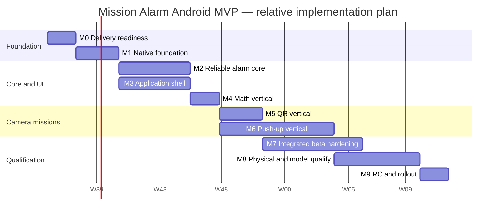

# Mission Alarm — Implementation Roadmap

| Field | Value |
|---|---|
| Product | Mission Alarm |
| Document | Implementation Roadmap |
| Version | 1.0 |
| Status | Accepted |
| Scope | Android MVP implementation through production qualification |
| Date | 2026-08-29 |
| Product baseline | [`../product/MVP_SCOPE.md`](../product/MVP_SCOPE.md) v1.0 Accepted |
| Feasibility baseline | [`../feasibility/TECHNICAL_FEASIBILITY.md`](../feasibility/TECHNICAL_FEASIBILITY.md) v0.2 Conditional Pass |
| Technical requirements | [`../requirements/TECHNICAL_REQUIREMENTS.md`](../requirements/TECHNICAL_REQUIREMENTS.md) v1.0 Accepted |
| System architecture | [`../architecture/SYSTEM_ARCHITECTURE.md`](../architecture/SYSTEM_ARCHITECTURE.md) v1.0 Accepted |
| CV specification | [`../cv/COMPUTER_VISION_SPECIFICATION.md`](../cv/COMPUTER_VISION_SPECIFICATION.md) v1.0 Specification Accepted — Model Qualification Pending |
| Database/API | [`../data/DATABASE_DESIGN.md`](../data/DATABASE_DESIGN.md) and [`../api/API_CONTRACT.md`](../api/API_CONTRACT.md) v1.0 Accepted |
| UI/UX | [`../ux/UI_UX_SPECIFICATION.md`](../ux/UI_UX_SPECIFICATION.md) v1.0 Accepted |
| Testing | [`../testing/TESTING_STRATEGY.md`](../testing/TESTING_STRATEGY.md) v1.0 Accepted |

## 1. Purpose

Dokumen ini mengubah seluruh baseline perancangan menjadi urutan implementasi yang dapat dieksekusi. Roadmap menetapkan workstream, dependency, milestone, exit gate, estimasi, resource assumption, release preparation, dan mekanisme perubahan scope.

Roadmap bukan janji tanggal kalender sebelum kapasitas tim, akses perangkat, dan ketersediaan participant CV dikonfirmasi. Estimasi menggunakan minggu relatif sejak kickoff implementation.

## 2. Delivery outcome

Fase implementasi berakhir hanya ketika tersedia Android MVP yang:

- menjalankan once/weekly alarm secara offline;
- memiliki native authoritative scheduling, runtime, emergency, persistence, dan recovery;
- menyediakan satu misi per alarm: Math, QR, atau verified Push-up;
- tidak memiliki snooze atau normal dismissal bypass;
- memenuhi accepted UI/UX dan accessibility gates;
- lulus automated, emulator, physical-device, privacy, performance, dan CV qualification;
- siap didistribusikan sebagai signed Android App Bundle melalui Google Play testing/production tracks.

## 3. Scope guardrails

### 3.1 Included

- Android API 24+ MVP.
- React Native/TypeScript application presentation.
- Kotlin native core, Room/SQLite, direct-boot mirror/journal, TurboModule boundary.
- Alarm scheduling, audio, notification/full-screen fallback, capability recovery.
- Math, QR, and Push-up missions.
- Local immutable history and basic settings.
- Native five-second emergency dismissal.
- Testing infrastructure, device qualification, CV dataset/evaluation, and release preparation.

### 3.2 Explicitly excluded

- iOS implementation.
- Backend, account, cloud sync/backup, or remote analytics SDK.
- Snooze.
- Multiple missions for one alarm.
- Custom user sounds.
- Statistics, streaks, points, badges, leaderboard, or other gamification.
- Replay/liveness/person identity detection.
- Knee/incline/wall push-up profiles.
- Data export or editable history.

Any excluded feature requires a change request; it is not inserted into a milestone opportunistically.

## 4. Baseline technology freeze

Initial production scaffold uses the accepted baseline:

| Area | Baseline |
|---|---|
| UI application | React Native 0.87, TypeScript Strict API |
| Native language | Kotlin 2.x baseline compatible with RN template |
| Runtime/tooling | Node.js 22+ compatible line; JDK 17 |
| Android build | AGP 9 template line, compile SDK 37, target SDK 36, minimum SDK 24 |
| Persistence | Room/SQLite; two native-owned databases |
| Native boundary | React Native Codegen typed TurboModule |
| Camera | CameraX 1.6.1 baseline, version locked |
| Pose | MediaPipe Tasks Vision 1.0.0 + Pose Landmarker Lite baseline |
| QR security | Native decoder adapter + Keystore-backed HMAC digest |
| Tests | Accepted Fase 8 toolchain and device matrix |

At kickoff, exact resolved versions and checksums are stored in dependency catalogs/lockfiles. No dynamic `latest.*` dependency is allowed. One controlled dependency review occurs before Release Candidate; upgrades require targeted regression and may be deferred when not security/policy-critical.

Target API 36 meets the Google Play requirement effective 2026-08-31. Policy/SDK requirements must still be rechecked at RC because store rules can change during the implementation window.

## 5. Delivery strategy

### 5.1 Vertical slices

Implementation proceeds through testable vertical slices instead of completing all UI, database, or platform code independently:

1. Typed query from RN to an empty native snapshot.
2. Persisted draft alarm from editor through TurboModule into Room.
3. Enabled alarm through outbox into `AlarmManager` and back to confirmed Home snapshot.
4. Real trigger through receiver/service/Alarm Host into emergency-safe active state.
5. Math as the first true mission-to-success vertical slice.
6. QR as the first camera/security vertical slice.
7. Push-up as the final and highest-risk mission vertical slice.

Each slice includes production behavior, negative tests, recovery, diagnostics, and accessibility relevant to that slice.

### 5.2 Risk-first ordering

- Physical device access, store policy declarations, and CV participant planning begin at M0.
- Native emergency shell exists before camera missions are integrated.
- Persistence/outbox/idempotency exist before real OS effects are considered complete.
- Math proves the full completion/history path before camera complexity.
- CameraX lifecycle is shared at adapter level, while QR and Push-up retain separate verification authority.
- CV dataset collection starts only after the capture/evaluation protocol and implementation profile are versioned, but participant recruitment/consent preparation starts earlier.

### 5.3 Spike isolation

`spikes/mobile-feasibility` remains read-only reference evidence. Production source is scaffolded independently. Code may be reimplemented after review, but spike Activities, test stop controls, permissive manifest entries, package identity, and provisional shortcuts are not copied wholesale.

## 6. Reference team and estimates

### 6.1 Reference delivery team

Calendar estimates assume:

| Role | Allocation |
|---|---:|
| Android/Kotlin engineer | 1.0 FTE |
| React Native/TypeScript engineer | 1.0 FTE |
| QA automation/device qualification | 0.5–0.75 FTE from M0; 1.0 during qualification |
| CV/ML engineer | 0.5 FTE from M0; 1.0 during M6/M8 |
| Product owner/UX | Part-time reviews and acceptance |
| Security/privacy reviewer | Milestone reviews and RC inspection |

One engineer may cover multiple roles, but calendar time increases and independent review must still occur for P0 safety/privacy paths.

### 6.2 Estimate range

| Scenario | Indicative calendar |
|---|---:|
| Reference team above | 24–30 weeks |
| Three full-time implementation engineers plus QA/CV support | 20–24 weeks |
| One full-time engineer with part-time specialist help | 60–85+ weeks |

Estimated total implementation/QA effort is approximately **59–81 person-weeks**, excluding participant recruitment delays, Play review time, and procurement lead time. Estimates are re-baselined after M1 and M6 using measured throughput and unresolved qualification risk.

## 7. Work breakdown structure

| Workstream | Scope | Estimate | Primary dependency |
|---|---|---:|---|
| WS-00 Delivery governance | Repository, decisions, CI policy, evidence registry, release administration | 3–4 pw | None |
| WS-10 Test foundation | Deterministic seams, fixtures, coverage, emulator lanes, fault harness | 5–7 pw | WS-00 |
| WS-20 Native domain/data/API | State machines, Room, outbox, repositories, direct boot, TurboModule | 8–10 pw | WS-00/10 |
| WS-30 Alarm runtime/safety | Scheduling, receiver, service/audio, notification, Alarm Host, emergency | 9–12 pw | WS-20 |
| WS-40 RN application UI | Navigation, editor, Home, History, Settings, permissions, tokens | 7–9 pw | WS-20 contract skeleton |
| WS-50 Math mission | Generator, persistence, RN runtime UI, completion/recovery | 2–3 pw | WS-20/30/40 |
| WS-60 QR mission | Registration, Keystore HMAC, native scanner, matching/recovery | 3–5 pw | WS-20/30; camera adapter |
| WS-70 Push-up mission | Camera/MediaPipe, state machine, overlay, test mode, qualification tooling | 9–13 pw | WS-20/30; test harness |
| WS-80 Hardening | Overlap, process/reboot, accessibility, security/privacy, performance | 6–8 pw | Feature vertical slices |
| WS-90 Qualification/release | Physical/CV qualification, Play tracks, report, staged release | 7–10 pw | WS-80 and model candidate |

`pw` means person-week. Workstreams overlap; their effort must not be added directly to calendar weeks.

## 8. Milestone roadmap

### Summary

| Milestone | Reference weeks | Outcome |
|---|---:|---|
| M0 — Delivery readiness | 1–2 | Production repository, identities, CI skeleton, devices/data plan ready |
| M1 — Native foundation vertical | 3–5 | Domain/data/API/test foundations compile and persist a draft alarm |
| M2 — Reliable alarm core | 6–10 | Real scheduled alarm reaches emergency-safe native active state |
| M3 — Application shell | 6–10, parallel | Accepted configuration/Home/History/Settings flows consume native snapshots |
| M4 — Math vertical slice | 11–12 | First complete trigger → mission → success/history path |
| M5 — QR vertical slice | 13–15 | Secure registration and exact-match camera mission complete |
| M6 — Push-up vertical slice | 13–20, parallel | Provisional CV implementation feature-complete and benchmarkable |
| M7 — Integrated beta hardening | 18–22 | All MVP features integrated; P0/P1 reliability/accessibility suites green |
| M8 — Physical and model qualification | 23–26 | Fase 2 closed; Push-up Model Qualified; exact artifact evidence ready |
| M9 — Release Candidate and rollout | 27–28 | Signed candidate passes release gates and enters staged production |

Weeks 29–30 are schedule contingency, not a container for extra scope.

### 8.1 M0 — Delivery readiness

Deliverables:

- New production React Native 0.87 project; spike remains separate.
- Final application ID/package name approved before first Play upload.
- Moderate Gradle/source module skeleton and dependency direction checks.
- `debug`, `test`, `benchmark`, and `release` behaviors separated; test hooks cannot compile into release.
- Dependency catalog, lockfiles, model checksum, license registry, and SBOM baseline.
- CI skeleton for typecheck, lint, unit tests, Codegen, Room schema, Android lint, debug/release-like build.
- Secure signing ownership and CI secret process documented; production key is not stored in repository.
- Google Play application created or release administration plan assigned.
- Draft exact-alarm, foreground-service, and full-screen-intent declaration evidence.
- Physical device P1–P5 access/procurement owner and target dates.
- CV consent, recruitment, secure dataset storage, annotation policy, and deletion policy drafted.
- Requirement-to-test registry skeleton.

Exit gate:

1. Clean checkout builds on CI and one developer host.
2. RN calls a typed native `getContractInfo`/empty snapshot and receives a validated response.
3. Release build contains no development server/test hook.
4. Package/signing/device/data-policy blockers have owners and due dates.

### 8.2 M1 — Native foundation vertical

Deliverables:

- Pure Kotlin domain primitives, enums, result types, clocks, IDs, dispatchers, and adapter ports.
- Alarm/occurrence/instance/mission state machines and invariants.
- Canonical and direct-boot Room V1 schemas, repositories, migrations, indexes, transactions.
- Outbox/effect leasing, command receipts, optimistic revisions, reconciliation skeleton.
- TurboModule Codegen spec, Kotlin mapping, validation, stable errors, advisory invalidations.
- TypeScript validated facade and screen-state query adapters.
- Deterministic unit/property fixtures, Room instrumentation, API round-trip tests, coverage reports.
- First vertical path: RN saves and re-queries a draft alarm.

Exit gate:

- All P0 state invariants have positive and negative unit tests.
- V1 schema/queries/migrations and both storage contexts open on emulator.
- Same command retry applies once; stale revision fails without mutation.
- Raw entity/secret/QR/CV types cannot cross the public bridge.
- Coverage meets the applicable Fase 8 thresholds.

### 8.3 M2 — Reliable alarm core

Deliverables:

- Capability inspection and just-in-time recovery actions.
- Exact scheduling/cancel/reschedule through persistence-first outbox.
- Explicit immutable occurrence `PendingIntent` and validated receiver.
- Atomic occurrence/instance creation and FIFO attention slot.
- Foreground service, packaged audio, audio focus policy, notification/channel, wake/lock behavior.
- `AlarmHostActivity`, native recovery surface, and native five-second emergency controller.
- Boot/locked-boot/user-unlocked/time/timezone/package-upgrade reconciliation.
- Direct-boot mirror rebuild and emergency journal import.
- Structured sanitized local diagnostics.
- Process-death, duplicate callback, failure injection, and API-specific instrumentation tests.

Exit gate:

1. Emulator API 24/31/33/36 alarm smoke passes.
2. Early P2 reference and P3 OEM physical smoke proves audio, locked screen, denied capability recovery, and emergency.
3. Duplicate callback produces one instance/audio effect.
4. RN process absence cannot break audio, native host, or emergency.
5. No production test stop/completion bypass exists.

M2 does not close Fase 2; it only produces the implementation required for later full qualification.

### 8.4 M3 — Application shell

Deliverables:

- Startup active-runtime gate and onboarding.
- Adaptive navigation: Home, History, Settings.
- Alarm list/editor, once/weekly schedule, labels, one-mission selection, packaged sound preview.
- Push-up/Math/QR configuration entry surfaces.
- Capability education and OS-settings recovery.
- Immutable history list/detail and settings readiness/privacy/about.
- Accepted colors, typography, spacing, Indonesian strings, dark/light themes.
- Loading/empty/error/conflict/pending/recovery states tied to authoritative snapshots.
- Component, reducer, screenshot, semantics, and 200% font-scale tests.

Exit gate:

- UX-01–10 and UX-17–19 core states pass component/UI review.
- UI never displays durable enabled/success from optimistic state.
- Compact/medium/expanded representative layouts have approved golden evidence.
- TalkBack navigation and 48dp/contrast automated gates pass for delivered screens.

### 8.5 M4 — Math mission vertical slice

Deliverables:

- Seeded native Math generator and persisted question rows.
- RN Math presentation inside native Alarm Host/emergency shell.
- Signed numeric input, wrong-answer no-change, correct progress, no skip.
- Completion transaction, history write, audio stop, queued-instance promotion.
- Process recreation and event-loss recovery.
- Full trigger → Math → `SUCCESS` and trigger → emergency E2E tests.

Exit gate:

- Math target boundaries and negative answers pass deterministic tests.
- Killing JS/process after committed answer restores exact question/progress.
- Repeated answer/completion cannot duplicate progress/history/effects.
- First real end-to-end success path passes on emulator and one physical reference device.

### 8.6 M5 — QR mission vertical slice

Deliverables:

- Native QR registration Activity, CameraX scanner adapter, and permission flow.
- Keystore HMAC key generation/use and digest-only persistence.
- Exact-match runtime Activity inside emergency shell.
- Mismatch/malformed/multiple-code/key-invalidation/camera-failure behavior.
- Torch and accessible scanning guidance where supported.
- Privacy inspection of DTO, log, database, screenshot, backup, and diagnostics.

Exit gate:

- Matching registered QR produces one success; mismatch never progresses.
- Raw QR never appears in persistence, logs, bridge, history, or error.
- Camera denial/recovery retains the same active instance.
- Camera/resource lifecycle closes immediately on terminal/leave.

### 8.7 M6 — Push-up mission vertical slice

Deliverables:

- Shared native camera adapter and front-camera latest-frame-only analysis.
- Pose Landmarker Lite lifecycle, image transform/normalization, and versioned profile v0.
- Pure Push-up state machine: visibility, side-on/alignment, phase, hysteresis, hold, cooldown, rep evidence.
- Native landscape/adaptive camera overlay, setup feedback, progress, emergency.
- Push-up configuration, target, safety guide, and Test Mission with no instance/history/audio.
- Persisted committed reps only; retry/recreation resets partial phase.
- Replay evaluator, annotation tools, metric report, and physical benchmark instrumentation.
- Initial pilot sessions covering valid/invalid/partial/body-loss cases.

Exit gate:

1. All pure state-machine fixture gates pass.
2. Camera/model startup, FPS, latency, thermal, and body-loss recovery measured on P2/P3.
3. Zero false completion in pilot invalid-only sessions.
4. Emergency works during forced camera/model failure.
5. Profile/dataset/tool versions are frozen for full M8 evaluation or a documented change is approved.

M6 is feature-complete with a **provisional** model/profile; it is not yet Model Qualified.

### 8.8 M7 — Integrated beta hardening

Deliverables:

- Overlapping alarm FIFO behavior across all mission/result types.
- Process death at every persistence/effect boundary.
- Reboot, pre-unlock, app upgrade, time/date/timezone, offline, Doze, battery saver, and permission matrices.
- Storage/log/audio/camera/model/Keystore failure injection.
- Full RN/native contract compatibility, error, event loss/duplicate, and release-surface tests.
- Accessibility completion across TalkBack, 200% font, Switch/Voice Access, keyboard/D-pad as applicable.
- Performance tuning based on traces; memory/resource lifecycle review.
- Security/privacy/manifest/backup/dependency review.
- Internal test App Bundle, Play pre-launch report, and defect burn-down.

Exit gate:

- All P0/P1 automated suites pass with zero known open P0/P1.
- Two consecutive critical suite runs pass on the same beta artifact.
- Internal testers can complete all three missions and emergency flow.
- Pre-launch stability/accessibility findings are triaged.
- Candidate is frozen except qualification fixes.

### 8.9 M8 — Physical and model qualification

Deliverables:

- Full Fase 8 physical-device matrix P1–P5 and exact scenario evidence.
- Alarm drift/audio/UI/DB/camera/model/FPS/latency/thermal metrics.
- Completed 30-participant CV dataset and fixed participant-separated held-out evaluation.
- Error analysis for false positive/negative and per-condition metrics.
- Qualified model/profile version and checksum, or explicit no-go/change decision.
- Manual accessibility and physical safety/reachability report.
- Updated Fase 2 feasibility report and Fase 5 qualification status.
- Exact-artifact qualification report draft.

Exit gate:

1. Fase 2 changes from Conditional Pass to Accepted based on physical evidence, or release remains blocked.
2. Fase 5 changes to Model Qualified, or Push-up is explicitly re-scoped through product change control.
3. All provisional performance targets pass or are revised with approved evidence.
4. No trapped-alarm, false-success, privacy leak, duplicate instance/result, or data-corruption scenario.

Failure at M8 loops to the owning milestone; metrics are never relaxed silently.

### 8.10 M9 — Release Candidate and rollout

Deliverables:

- Dependency/policy refresh and full regression decision.
- Final versioned Room schemas/migrations, model/profile, license notices, SBOM, and checksums.
- Signed, minified/optimized Android App Bundle from protected CI release process.
- Play listing, privacy policy, Data safety answers, exact-alarm and full-screen-intent/foreground-service declarations.
- Internal then closed test artifact; Play pre-launch report resolved.
- Final qualification report with exact AAB checksum and `GO/NO-GO`.
- Store support/runbook, known platform boundaries, and rollback/hotfix procedure.
- Staged production rollout with Play Vitals/crash/ANR monitoring and user-support observation; no in-app remote analytics SDK is added.

Exit gate:

- Every release gate in Fase 8 Section 24 passes.
- Product owner and technical/release owners approve the same candidate artifact.
- Zero open P0/P1 and no unapproved P2 exception.
- Rollback artifact/process and signing access are verified.

## 9. Reference schedule



The diagram illustrates dependency, not a committed start date. M3 and CV recruitment/tooling run in parallel; M7 begins when Math/QR are complete and joins Push-up as it stabilizes. Final RC waits for both integrated hardening and M8 qualification.

## 10. Critical path

```text
M0 identities/devices/data plan
  → M1 domain + Room + contract
  → M2 trigger/audio/Alarm Host/emergency
  → M4 Math completion proves terminal workflow
  → M6 Push-up implementation candidate
  → M8 physical + held-out model qualification
  → M9 exact-artifact release gate
```

Parallel but release-critical tracks:

- M1 → M3 application UI → M7 accessibility/integration.
- M0 → participant consent/recruitment → M6 pilot → M8 held-out evaluation.
- M0 → device access → M2 smoke → M7/M8 qualification.
- M0 → Play declarations/signing → M7 internal test → M9 production.

Physical-device access or participant recruitment delayed beyond M2 directly threatens the critical path even if feature coding remains on schedule.

## 11. Module scaffolding plan

Start with moderate boundaries; do not create a Gradle module for every package.

```text
mobile/
├── src/                         # React Native/TypeScript application
│   ├── app/
│   ├── features/
│   ├── design-system/
│   └── native/
└── android/
    ├── app/                     # Android components, RN host, assembly
    ├── native-core/             # pure domain, application, data, effects, bridge contracts
    ├── mission-camera/          # CameraX, QR, MediaPipe adapters and native mission UI
    ├── test-support/            # test/debug-only fixtures and fault injection
    └── benchmark/               # release-like Macrobenchmark application tests
```

Within `native-core`, packages preserve accepted domain/application/data/platform direction. Split further only when ownership, build time, or dependency isolation evidence justifies it. `mission-camera` depends on public native-core ports, never Room entities. `test-support` is unavailable to release source sets.

## 12. Dependency and interface rules

1. Pure domain has no Android, Room, React Native, CameraX, MediaPipe, clock-global, or network dependency.
2. Application services depend on ports; platform/data adapters implement them.
3. RN imports only the TypeScript facade, never internal Codegen/native files through deep imports.
4. Room entities and SQL remain native-internal.
5. Camera frames, landmarks, QR payloads/digests, answer keys, and secrets never cross the RN bridge.
6. Mission engines do not directly stop audio or write history; coordinator owns terminal workflow.
7. No JS method can set verified progress, success, or emergency result.
8. Events invalidate; snapshots remain authoritative.
9. Build dependency graph is checked in CI with no cycles or forbidden imports.

## 13. Backlog and delivery policy

### 13.1 Work-item hierarchy

```text
Milestone
└── Epic / workstream item
    └── User story or technical story
        ├── implementation task
        ├── automated tests
        ├── device/manual evidence when required
        └── documentation/traceability update
```

Every work item carries requirement IDs, risk priority, owner, dependency, acceptance tests, and evidence link.

### 13.2 Definition of Ready

A story may enter implementation only when:

- scope and out-of-scope are clear;
- linked AC/TR/ADR and UI/API/data contracts are identified;
- owner and reviewer are assigned;
- test layer, fixtures, and expected failure behavior are known;
- external asset/license/device/policy dependency is available or explicitly tracked;
- no unresolved decision would cause major rework.

### 13.3 Definition of Done

A story is done only when:

- production code and tests are merged;
- static/type/lint/build gates pass;
- positive, boundary, and applicable failure scenarios pass;
- source-of-truth, privacy, accessibility, and release-variant rules are preserved;
- diagnostics are structured/redacted;
- requirement/test traceability and affected documentation are updated;
- no new unowned warning, flaky test, or P0/P1 defect remains.

“Code complete” without evidence is not done.

## 14. Branch, review, and integration policy

- Keep main branch releasable; use short-lived branches and small reviewable changes.
- P0 domain/safety/privacy changes require at least one independent reviewer with relevant ownership.
- Database schema, API contract, model/profile, permissions, exported component, backup policy, or release dependency changes require an explicit change note.
- Merge requires PR fast gate; Android runtime changes also require device smoke.
- Feature flags may hide incomplete non-authoritative UI but cannot bypass alarm lock, mission verification, or emergency logic.
- Test/debug-only source sets provide deterministic controls; production does not accept runtime flags that reveal them.
- A release branch is cut only at M7 candidate freeze; fixes are merged back to main.

## 15. Design and product review cadence

| Review | Cadence | Output |
|---|---|---|
| Weekly delivery/risk review | Weekly | Progress, blockers, risk owners, scope change decisions |
| Architecture/API/data review | At M1 and any contract/schema change | Boundary and migration approval |
| UX implementation review | End of M3, per mission, and M7 | Visual/state/accessibility sign-off |
| Device evidence review | M2 smoke, M6 benchmark, M8 full | Measured feasibility/performance decisions |
| Security/privacy review | M1 boundary, M5/M6 camera, M7, M9 | Findings and release disposition |
| Release readiness review | M7 beta and M9 RC | Candidate freeze and GO/NO-GO |

## 16. Device, data, and external readiness

### 16.1 Devices

By M0, assign access to the accepted P1–P5 physical/remote device slots. By M2, P2 and P3 must be usable for early alarm smoke. By M6, at least three distinct CV devices must be available.

Device inventory records make/model, API, security patch, SoC/RAM, camera, battery health, and OEM power settings. Personal daily-use devices are not the only qualification evidence.

### 16.2 CV participants and data

- Obtain informed consent and a withdrawal/deletion process before recording.
- Do not infer or label sensitive attributes automatically.
- Store participant identity separately from evaluation assets and use pseudonymous IDs.
- Restrict access, define retention, and prohibit dataset inclusion in app/repository artifacts.
- Two reviewers annotate rep boundaries; disagreements are adjudicated.
- Held-out participant split is frozen before threshold tuning.

Recruitment starts during M0–M1, pilot capture during M6, and full evaluation in M8.

### 16.3 Assets and licenses

All received sound, icon, illustration, model, font, and library licenses are recorded with source, version, permitted use, attribution requirement, and checksum where applicable. Only approved built-in sounds are packaged. The release notice bundle is generated from this registry.

### 16.4 Play Console readiness

Prepare early:

- permanent package/application identity;
- organization/developer account and signing ownership;
- privacy policy and support contact;
- Data safety answers consistent with on-device/no-account design;
- exact alarm permission declaration;
- full-screen intent and foreground-service declarations;
- camera permission purpose and store listing consistency;
- internal/closed tester groups and feedback channel.

Policy approval is an external dependency; engineering must preserve a heads-up/recovery fallback if full-screen access is denied.

## 17. Quality gates by milestone

| Gate | M0 | M1 | M2 | M3 | M4–6 | M7 | M8 | M9 |
|---|:---:|:---:|:---:|:---:|:---:|:---:|:---:|:---:|
| Static/type/lint/build | ✓ | ✓ | ✓ | ✓ | ✓ | ✓ | ✓ | ✓ |
| Unit/property coverage | Setup | ✓ | ✓ | ✓ | ✓ | ✓ | ✓ | ✓ |
| Room/API contract | Skeleton | ✓ | ✓ | ✓ | ✓ | ✓ | ✓ | ✓ |
| Emulator integration | Smoke | ✓ | ✓ | ✓ | ✓ | ✓ | ✓ | ✓ |
| Physical device | Plan | Early smoke | P2/P3 smoke | UI spot | Camera/mission benchmark | Beta matrix | Full matrix | RC smoke |
| Accessibility | Rules | Semantics base | Emergency | App shell | Mission flows | Full | Manual physical | Pre-launch/RC |
| Security/privacy | Baseline | Boundary | Components | UI copy | QR/CV | Full inspection | Evidence | Final binary |
| CV accuracy | Plan | Tool skeleton | — | — | Pilot | Candidate | Held-out qualification | Frozen model |
| Release report | Template | — | — | — | Metrics | Draft | Complete evidence | GO/NO-GO |

## 18. Risk register and triggers

| Risk | Trigger | Planned response | Owner phase |
|---|---|---|---|
| OEM misses/blocks alarm | P3 smoke failure or unacceptable drift | Inspect policy/capability/fallback; do not mask; revise implementation/requirements with evidence | M2/M8 |
| Play exact/full-screen declaration rejected | Console review issue | Use compliant permission choice, strengthen core-use evidence/fallback; legal/policy review | M0/M9 |
| RN/AGP/dependency regression | Build warning/failure or release blocker | Pin, adapter-isolate, targeted upgrade branch and full contract/runtime regression | M0–M9 |
| Direct-boot/storage reconciliation defect | Duplicate/lost state in failure suite | Stop feature expansion; fix transaction/journal invariants first | M1/M2 |
| Trapped alarm/emergency defect | Any unrecoverable active state | P0 stop-ship; add native regression and device test | M2–M9 |
| Push-up false positive | Any invalid-only false completion | P0 no-go; tighten gates/features and rerun held-out evaluation | M6/M8 |
| Push-up false negative/setup burden | Recall/completion gate miss | Improve setup feedback/profile; compare Full only under accepted rules; re-evaluate | M6/M8 |
| Low-end performance/thermal | PERF gate failure | Tune resolution/FPS/latest-frame policy; profile model; explicit device-floor decision if unresolved | M6/M8 |
| Participant recruitment delay | Fewer than required participants by M6 freeze | Increase recruitment channels; protect consent; release remains blocked | M0–M8 |
| Physical device unavailable | P2/P3 not ready by M2 | Use approved remote lab/borrowed test unit; do not substitute emulator for qualification | M0–M8 |
| Scope growth | New post-MVP request enters active milestone | Change request with schedule/risk impact; default to post-MVP backlog | All |

## 19. Change control

A change request is mandatory for:

- accepted AC/TR/ADR/API/schema/UI behavior changes;
- platform/min/target SDK changes;
- new permission, exported component, network dependency, or analytics SDK;
- mission rules, CV model/profile/threshold, dataset, or accuracy gate changes;
- adding any excluded feature;
- release target or physical qualification reduction.

Change record includes rationale, affected requirements/documents, security/privacy/accessibility impact, migration/API compatibility, test impact, estimate delta, and approve/reject decision. Approved change updates source documents before or with implementation.

## 20. Release strategy

### 20.1 Channels

1. **Local/debug:** developer iteration; never user-distributed.
2. **Internal test:** production-like AAB for team/device lab and Play pre-launch report.
3. **Closed test:** selected testers across target devices; collect structured alarm/mission/accessibility feedback.
4. **Release Candidate:** frozen artifact undergoing exact-artifact qualification.
5. **Production staged rollout:** 5% → 20% → 50% → 100%, with minimum 48–72 hours observation per step unless evidence requires longer.

Rollout progression requires no new P0/P1, acceptable Play Vitals/crash/ANR signals, no policy warning, and no supported-condition alarm regression from user/support evidence. Without an in-app analytics SDK, operational review relies on Play platform quality signals, explicit tester/support reports, and opt-in sanitized diagnostics if such export is implemented later through separate approval.

### 20.2 Rollback and hotfix

- Store retains previous known-good source/artifact metadata; Android version codes remain monotonic.
- Rollback on Play is generally a new higher-version build restoring known-good behavior, not reinstalling an older version over newer user data.
- Database migrations must remain forward-compatible with rollback strategy; destructive downgrade is not assumed safe.
- P0 response pauses rollout, opens incident ownership, preserves evidence, and prioritizes a tested higher-version hotfix.
- Any alarm lock/emergency issue requires immediate rollout stop even if crash metrics appear normal.

## 21. Release readiness checklist

### Product and UX

- All accepted MVP screens/flows implemented; excluded features absent.
- Indonesian copy reviewed; time/date formats and accessibility verified.
- Emergency result is visibly distinct from success.

### Engineering

- Exact candidate source revision, AAB checksum, model/profile, dependencies, and Room schemas recorded.
- Release binary is signed, optimized, non-debuggable, and stripped of test/dev surfaces.
- Reboot/process/overlap/permission/direct-boot paths pass.

### Quality

- Fase 8 Section 24 passes twice on the same candidate where specified.
- Fase 2 physical feasibility is Accepted.
- Fase 5 Push-up Model is Qualified.
- Zero open P0/P1 and approved disposition for any P2.

### Privacy/security/policy

- No raw QR/camera/landmark/answer/secret in persistence/log/bridge/artifact.
- Backup, exported components, PendingIntent, Keystore, permissions, and dependency checks pass.
- Play declarations, Data safety, privacy policy, license notices, and support information are complete.

### Operations

- Internal/closed tester feedback triaged.
- Pre-launch report reviewed.
- Staged rollout, pause, hotfix, signing access, and incident owner documented.

## 22. Progress reporting

Weekly report contains:

- milestone forecast versus reference range;
- completed/accepted deliverables rather than percent-code-complete;
- P0/P1 test status and open defects;
- physical device/CV recruitment and qualification status;
- dependency/policy/external blockers;
- decisions needed from product owner;
- risk changes and contingency consumption.

Burndown alone is insufficient because qualification and external gates carry more release risk than raw story count.

## 23. Implementation start checklist

After this roadmap is accepted, implementation may begin with M0 only when:

- workspace/repository destination is confirmed;
- application display name and permanent Android package/application ID are approved;
- source control and CI provider are available;
- signing-key ownership approach is approved;
- physical/remote device acquisition has an owner;
- CV participant consent/data handling has an owner;
- reference team capacity is known enough to convert relative weeks into calendar dates.

Missing calendar inputs do not invalidate architecture, but they prevent committing exact release dates.

## 24. Accepted roadmap decision record

Seluruh keputusan berikut disetujui product owner pada 2026-08-29.

| ID | Accepted decision | Impact/trade-off |
|---|---|---|
| IMP-ADR-001 | Gunakan risk-first vertical slices; Math menjadi first complete mission path, lalu QR, lalu Push-up. | Membuktikan terminal workflow lebih awal; Push-up hadir lebih akhir tetapi risikonya diisolasi. |
| IMP-ADR-002 | Reference roadmap 24–30 minggu dengan sekitar 59–81 person-weeks untuk team assumption Section 6. | Estimasi realistis untuk reliability/CV/device gates; tanggal final bergantung kapasitas dan external lead time. |
| IMP-ADR-003 | Production source dibuat baru; feasibility spike hanya menjadi reference evidence dan tidak disalin wholesale. | Menghindari shortcut/test hook masuk production; membutuhkan reimplementation terkontrol. |
| IMP-ADR-004 | Mulai dengan app assembly plus empat supporting Android modules dan RN source, lalu split hanya dengan evidence. | Menjaga boundary tanpa over-modularization; sebagian package masih berbagi module. |
| IMP-ADR-005 | Test foundations, deterministic seams, Room/API skeleton, dan CI dibuat sebelum feature expansion. | Mengurangi rework/failure blindness; visible feature progress lebih lambat pada awal proyek. |
| IMP-ADR-006 | Device access, Play declarations/signing, dan CV consent/recruitment dimulai pada M0 sebagai critical-path work. | Mengurangi late qualification surprise; membutuhkan koordinasi/non-coding effort sejak awal. |
| IMP-ADR-007 | Dependency baseline dikunci saat M0 dan hanya memiliki controlled pre-RC refresh window selain security/policy fixes. | Stabilitas build lebih tinggi; fitur library terbaru dapat ditunda. |
| IMP-ADR-008 | Build memisahkan debug/test/benchmark/release; test hooks tidak dapat dikompilasi ke release dan diverifikasi binary inspection. | Fault injection aman; konfigurasi build lebih kompleks. |
| IMP-ADR-009 | M8 wajib menutup Fase 2 menjadi Accepted dan Fase 5 menjadi Model Qualified sebelum M9 production GO. | Tidak ada release berdasarkan emulator/provisional model saja; qualification failure menunda release. |
| IMP-ADR-010 | Distribusi melalui internal → closed → exact-artifact RC → staged production 5/20/50/100. | Blast radius lebih kecil; rollout membutuhkan waktu observasi. |
| IMP-ADR-011 | Semua out-of-scope request masuk change control dan default ke post-MVP backlog. | Melindungi critical path; stakeholder tidak mendapat tambahan scope tanpa trade-off eksplisit. |
| IMP-ADR-012 | Roadmap dire-baseline setelah M1 dan M6, tetapi quality/release gates tidak diturunkan untuk mengejar tanggal. | Forecast menjadi evidence-based; tanggal dapat berubah saat risiko nyata diketahui. |

## 25. Phase 9 acceptance gates

- IMP-ADR-001–012 disetujui atau direvisi.
- Workstream, milestone, dependency, critical path, dan exit criteria cukup jelas untuk membuat backlog implementation.
- Estimate menyatakan assumption dan tidak menyembunyikan device/CV/policy external lead time.
- Test/security/accessibility/privacy work terintegrasi ke milestone, bukan ditunda seluruhnya ke akhir.
- Fase 2 Conditional Pass dan Fase 5 Model Qualification Pending memiliki explicit closure milestone.
- Release plan mencakup exact artifact, store declarations, internal/closed testing, staged rollout, dan rollback/hotfix.
- Scope guardrails mencegah post-MVP feature masuk tanpa change control.
- M0 start checklist mengidentifikasi input yang dibutuhkan sebelum tanggal kalender dikunci.

### 25.1 Personal/portfolio scope amendment — 2026-08-29

Product owner menetapkan bahwa aplikasi saat ini dibuat untuk penggunaan pribadi dan portfolio, tanpa rencana distribusi Google Play dalam waktu dekat. Karena itu:

- permanent application ID `com.missionalarm.app` disetujui;
- GitHub menjadi source-control provider;
- Play Console, production signing, store declaration, staged rollout, formal team allocation, dan broad device certification ditunda dan tidak memblokir M1–M6;
- pengujian fungsional memakai perangkat Android milik product owner;
- pengembangan CV awal hanya memakai data product owner sendiri; pengumpulan data pihak ketiga dilarang sampai consent/storage/deletion governance diaktifkan;
- reliability alarm, emergency dismissal, offline behavior, privacy boundary, dan test-hook exclusion tetap wajib karena merupakan kualitas fungsi aplikasi, bukan hanya persyaratan store;
- milestone M7–M9 dan qualification matrix penuh diaktifkan kembali hanya bila scope berubah menjadi distribusi publik atau klaim kompatibilitas luas.

Amendment ini mengubah deployment/governance gate, bukan product behavior atau safety invariant yang telah diterima.

## 26. Post-approval execution

Setelah roadmap diterima:

1. Ubah status dokumen menjadi `Accepted` v1.0.
2. Buat M0 implementation backlog dan requirement/test registry.
3. Konfirmasi permanent application ID, repository/CI, signing ownership, dan team capacity.
4. Scaffold production application and CI without importing spike source.
5. Jalankan M0 exit review sebelum masuk M1.

## 27. Primary references

- [React Native — 0.87 release and Strict TypeScript API](https://reactnative.dev/blog/2026/08/11/react-native-0.87)
- [Android Developers — Guide to app architecture](https://developer.android.com/topic/architecture)
- [Android Developers — Guide to app modularization](https://developer.android.com/topic/modularization)
- [Android Developers — Build variants](https://developer.android.com/build/build-variants)
- [Google Play — Target API level requirements](https://support.google.com/googleplay/android-developer/answer/11926878)
- [Google Play — Exact alarm permission policy](https://support.google.com/googleplay/android-developer/answer/16558241)
- [Google Play — Foreground service and full-screen intent requirements](https://support.google.com/googleplay/android-developer/answer/13392821)
- [Google Play — Internal, closed, and open testing](https://support.google.com/googleplay/android-developer/answer/9845334)
- [Google Play — Pre-launch reports](https://support.google.com/googleplay/android-developer/answer/9842757)
