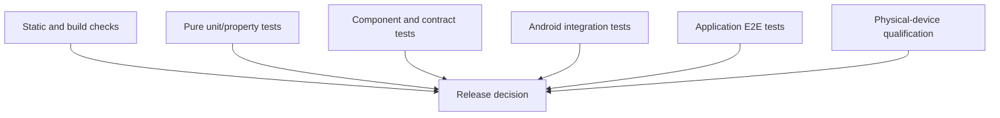

# Mission Alarm — Testing Strategy

| Field | Value |
|---|---|
| Product | Mission Alarm |
| Document | Testing Strategy |
| Version | 1.0 |
| Status | Accepted |
| Scope | Android MVP verification and release qualification |
| Date | 2026-08-29 |
| Product baseline | [`../product/MVP_SCOPE.md`](../product/MVP_SCOPE.md) v1.0 Accepted |
| Feasibility baseline | [`../feasibility/TECHNICAL_FEASIBILITY.md`](../feasibility/TECHNICAL_FEASIBILITY.md) v0.2 Conditional Pass |
| Technical requirements | [`../requirements/TECHNICAL_REQUIREMENTS.md`](../requirements/TECHNICAL_REQUIREMENTS.md) v1.0 Accepted |
| System architecture | [`../architecture/SYSTEM_ARCHITECTURE.md`](../architecture/SYSTEM_ARCHITECTURE.md) v1.0 Accepted |
| CV specification | [`../cv/COMPUTER_VISION_SPECIFICATION.md`](../cv/COMPUTER_VISION_SPECIFICATION.md) v1.0 Specification Accepted — Model Qualification Pending |
| Database/API | [`../data/DATABASE_DESIGN.md`](../data/DATABASE_DESIGN.md) and [`../api/API_CONTRACT.md`](../api/API_CONTRACT.md) v1.0 Accepted |
| UI/UX | [`../ux/UI_UX_SPECIFICATION.md`](../ux/UI_UX_SPECIFICATION.md) v1.0 Accepted |

## 1. Purpose

Dokumen ini menetapkan bagaimana Mission Alarm membuktikan functional correctness, reliability, safety, privacy, accessibility, performance, dan compatibility sebelum rilis. Strategi mencakup test architecture, test levels, fixtures, fault injection, device matrix, CI cadence, defect policy, evidence, serta release gates.

Fase 8 menetapkan rancangan pengujian. Eksekusi penuh baru dapat diselesaikan setelah production implementation tersedia. Karena itu status dokumen dapat diterima sebelum seluruh test lulus, tetapi product tidak dapat berstatus production-ready sampai release qualification report memenuhi semua gate di dokumen ini.

## 2. Quality objectives

Urutan prioritas kualitas:

1. Tidak ada false mission success.
2. Tidak ada trapped alarm; emergency dismissal atau fallback OS yang terdokumentasi selalu tersedia.
3. Tidak ada missed/duplicate active instance akibat race, retry, reboot, atau process recreation.
4. Tidak ada kerusakan durable state, duplicate history, atau perubahan retroaktif pada active/history snapshot.
5. Data kamera, QR, answer, secret, dan diagnostic sensitif tidak bocor.
6. Alarm tetap berfungsi offline dan saat React Native runtime tidak tersedia.
7. Core flow dapat digunakan secara aksesibel.
8. Performance dan CV memenuhi target pada perangkat fisik yang mewakili pengguna.

## 3. Test principles

- Pilih test layer terendah yang dapat membuktikan perilaku dengan fidelity memadai.
- Domain logic harus deterministic dan berjalan tanpa Android framework bila memungkinkan.
- OS behavior, SQLite sebenarnya, lifecycle, audio, kamera, permission, dan lock screen dibuktikan pada emulator/perangkat.
- Test tidak memakai wall clock, random generator, UUID, atau timezone global yang tidak dapat dikendalikan.
- State authoritative selalu diperiksa melalui database/native snapshot, bukan hanya tampilan UI atau callback.
- Negative assertions sama pentingnya: tidak ada success, tidak ada duplicate, tidak ada forbidden data, dan tidak ada release-only bypass.
- Retry CI tidak boleh menyamarkan flaky test.
- Emulator memberi regression coverage; perangkat fisik memberi release evidence untuk hardware/OEM behavior.
- Coverage percentage adalah alarm untuk gap, bukan pengganti scenario/risk review.

## 4. Risk model and test priority

| Priority | Meaning | Examples | Required cadence |
|---|---|---|---|
| P0 | Dapat menghasilkan false success, trapped alarm, privacy leak, data corruption, atau safety failure | Completion bypass, emergency unavailable, raw QR logged | Every PR at lowest feasible layer; physical RC qualification |
| P1 | Core alarm gagal, terlambat berat, duplicate, atau progress/history salah | Missed trigger, duplicate audio, queue disorder, lost progress | Every PR/post-merge; full device RC matrix |
| P2 | Feature utama dapat dipulihkan tetapi experience salah | Permission copy/state mismatch, layout clipping, preview failure | Feature/visual suites; representative device matrix |
| P3 | Cosmetic/non-blocking issue | Minor spacing or non-critical animation | Component/screenshot review |

Setiap requirement mempunyai minimal satu positive test dan, untuk P0/P1, minimal satu negative/failure test.

## 5. Test architecture



Test suite mengikuti risk-weighted pyramid: unit/component tests paling banyak; instrumented/E2E lebih sedikit namun mencakup boundary berisiko; physical-device scenarios paling terpilih tetapi wajib untuk rilis.

### 5.1 Layers

| Layer | Environment | Primary subjects | Typical tools |
|---|---|---|---|
| Static/build | CI host | Type safety, lint, schemas, manifest, dependency/model integrity, release surface | TypeScript compiler, ESLint, Android Lint, Gradle, RN Codegen, checksum/SBOM checks |
| Pure unit | Node/JVM host | Recurrence, reducers, validators, state machines, Math, QR matching, idempotency rules | Jest; Kotlin test/JUnit; property/fuzz helpers |
| Component | Host or focused emulator | RN components, screen states, native composables/views, error mapping | Jest + React Native Testing Library; Compose UI test or Espresso |
| Contract | Host + instrumented round-trip | TurboModule types/mapping, ack/query/event semantics, compatibility | Codegen compile, fixture round-trip, native boundary harness |
| Persistence/integration | Android emulator/device | Room/SQLite, migrations, transactions, receiver/service/outbox | AndroidJUnitRunner, Room testing, fakes/fault injectors |
| Application E2E | Emulator/device | Cross-screen and cross-component workflows | UI Automator plus Compose/Espresso interoperability; native test harness |
| Performance | Physical device, release-like build | Trigger/audio/UI/camera/model/DB latency, FPS, memory, thermal | Macrobenchmark/custom trace sections, Perfetto, Camera/CV metrics harness |
| CV qualification | Offline replay + live physical devices | Accuracy, invalid motion, robustness, performance | Versioned dataset evaluator and on-device qualification runner |
| Accessibility/manual | Emulator + physical device | TalkBack, Switch/Voice Access, font/display scaling, contrast | Compose UI Check, Accessibility Scanner, manual scripts |

Tool versions are pinned with the production dependency catalog/lockfile. No test tool is allowed to add a release runtime dependency unless explicitly reviewed.

### 5.2 Selected test toolchain

| Scope | Baseline selection |
|---|---|
| Kotlin host | JUnit 5 + `kotlin-test` + `kotlinx-coroutines-test`; hand-written fakes preferred over broad mocking |
| Android instrumented | JUnit 4 via `AndroidJUnitRunner`, AndroidX Test, Room testing, Compose UI Test/Espresso according to rendered surface |
| Cross-app/system UI | UI Automator for native/RN/Settings/lock-screen boundaries |
| RN host | Jest + React Native Testing Library with user-visible/accessibility queries |
| Coverage | Kotlin Kover and Jest/Istanbul reports, merged per source domain where technically valid |
| Isolation | Android Test Orchestrator for independent tests; explicit fixture reset for stateful sequences |
| Devices | Gradle build-managed devices where supported; conventional API 24 AVD plus physical/remote device lab |
| Performance | AndroidX Macrobenchmark, custom trace sections/metrics, Perfetto analysis for outliers |

Large textual React snapshots are not a primary assertion strategy. Tests prefer explicit visible text, accessibility role/state, persisted snapshot, database invariant, and observable OS effect.

## 6. Testability requirements

Production architecture must provide these seams without weakening release security:

| Seam | Purpose | Release rule |
|---|---|---|
| `Clock` and timezone provider | Deterministic one-time/weekly/DST calculations | Production adapter uses system clock/zone |
| ID and command-ID provider | Reproduce dedupe/idempotency scenarios | Production adapter generates UUID v4 |
| Alarm scheduler adapter | Assert exact schedule/cancel request | Production adapter wraps `AlarmManager` |
| Capability inspector | Enumerate grant/deny/recovery states | Production adapter always reads fresh OS state |
| Audio/notification/wake adapters | Verify desired effects and injected failures | Real adapters only in release |
| Camera, pose, QR decoder adapters | Replay fixtures and simulate failure/loss | No raw frame test endpoint in release |
| Effect executor fault points | Crash/fail before and after effect/ack boundaries | Compiled only in test/debug variants |
| Database fixture factory | Seed every aggregate/runtime state | Not exported; no release activity/provider |
| Diagnostic sink | Assert structured/redacted events and logging failure | Production retention remains bounded |

Test-only controls use a separate test application ID/manifest or source set. Release build inspection must prove the absence of receiver triggers, fake completion, emergency shortcuts, DB seed endpoints, debug menus, and arbitrary stop actions.

## 7. Determinism and test data

### 7.1 Deterministic inputs

- Fixed `Instant`, `ZoneId`, locale, 12/24-hour preference, and DST fixtures.
- Seeded Math generator; expected answer remains native/private.
- Stable alarm/occurrence/instance/command IDs in fixtures.
- Explicit ordered coroutine/test dispatcher and serialized aggregate executor.
- Virtual time for retry/backoff/hold logic at unit level; real elapsed time only for interaction/device latency qualification.
- No arbitrary `sleep()` as readiness proof. Poll an observable persisted/system condition with a bounded timeout.

### 7.2 Fixture catalog

| Fixture family | Minimum content |
|---|---|
| Alarm configuration | Once/weekly, every weekday pattern, all mission types, boundary targets, enabled/draft/deleted |
| Occurrence | Due/future/duplicate key/DST gap/DST overlap/timezone changed |
| Runtime | Every non-terminal state, queued FIFO instances, partial committed progress, recovery required |
| History | Success/emergency/system-failed immutable snapshots; orphaned source alarm |
| Command receipt | First apply, same payload retry, payload mismatch, expired receipt |
| Effect/outbox | Pending, leased, retryable, blocked capability, applied, stale lease |
| Capability | Not requested, granted, denied, permanently denied/restricted, OS-unavailable |
| API | Valid DTO per enum/state plus unknown enum/version/oversized/malformed inputs |
| CV | Valid cycles, partial depth, invalid alignment, repeated frames, low visibility, body loss/recovery |
| QR | Exact match, mismatch, malformed, multiple code, rotated/low-light, key invalidated |

Fixtures never contain real user QR values or production diagnostics. CV assets require explicit consent, dataset ID/version, access control, and exclusion from application artifacts.

## 8. Static, build, and supply-chain tests

Every pull request must verify:

1. TypeScript strict typecheck and ESLint with zero errors.
2. Kotlin compilation, static analysis, and Android Lint.
3. Debug, test, and release-like compilation.
4. React Native Codegen artifact generation with no uncommitted schema drift.
5. Room schema export and schema diff review.
6. Resource/string completeness and no hard-coded user-facing strings in critical UI.
7. Manifest exported/component/permission/backup rules.
8. Dependency lock/checksum integrity, including pose model checksum.
9. Forbidden release symbol/string scan for debug server, test hooks, fake success, raw CV/QR logging, and arbitrary alarm stop.
10. License inventory generation for packaged dependencies/assets.

Build warnings introduced by a change are reviewed; known baseline warnings are explicitly tracked and may not grow silently.

## 9. Unit and property-based test specification

### 9.1 Alarm scheduling domain

Test at minimum:

- next occurrence for one-time and every weekly weekday combination;
- local time across timezone changes, DST gap, and DST overlap;
- past-time rollover and exact boundary timestamps;
- enable/disable/edit/delete transition validation;
- occurrence dedupe key stability;
- reboot/time/date/timezone reconciliation plan;
- schedule/cancel effect identity and retry classification;
- overflow-safe timestamp arithmetic and invalid input rejection.

Property tests generate dates/timezones/schedules and assert: next occurrence is valid for the configured recurrence, never precedes the allowed reference instant, and serializing/reloading configuration does not change the result.

### 9.2 Instance and overlap state machine

- Exactly one attended instance is allowed.
- Duplicate receiver callbacks create one occurrence/instance and one audio-start desire.
- Two or more occurrences are ordered FIFO with deterministic tie-break.
- Resolving the active instance promotes exactly one queued instance.
- Editing/disabling/deleting an alarm does not mutate its active instance snapshot.
- Terminal transition is one-way and one-result-only.
- Repeated completion/emergency event is idempotent.
- No error, timeout, low confidence, permission denial, or restart transitions to success.

Use model-based tests to generate command sequences and continuously assert database/domain invariants.

### 9.3 Mission engines

| Engine | Required unit coverage |
|---|---|
| Math | Seed reproducibility, operation rules, negative/zero/boundary answers, incorrect no-change, correct progress, persisted next question, no skip |
| QR | HMAC/digest exact match, mismatch, constant-safe comparison where applicable, key invalidation, no raw payload output |
| Push-up | Visibility/alignment gate, phase/hysteresis/hold timing, partial/invalid rejection, repeated-frame suppression, committed rep only, recovery resets half-rep |
| Emergency | 5-second monotonic hold, early release/pointer loss reset, duplicate completion, wrong session rejection |

### 9.4 API/UI logic

- DTO validator accepts all valid contract fixtures and rejects invalid range/type/enum/state combinations.
- Stable native errors map to correct Indonesian copy/action without leaking metadata.
- UI reducer handles loading/content/empty/recoverable/conflict/terminal states.
- Advisory event loss or duplication results in the same state after re-query.
- Pending mutation never renders durable success/enabled before authoritative snapshot.

## 10. Database and migration tests

Room tests run against Android SQLite, not only a host substitute.

### 10.1 Schema and query tests

- Every table constraint, foreign key behavior, unique key, and check constraint.
- Unique attended slot and queue order under concurrent transactions.
- Occurrence/result/history/command receipt uniqueness.
- Hard-delete alarm preserves immutable history and nulls allowed source links.
- Query result ordering and pagination stability.
- `EXPLAIN QUERY PLAN` confirms required indexes for active FIFO, next occurrence, due effect, and recent history.
- Cleanup respects active/in-flight records and retention periods.

### 10.2 Transaction and crash tests

Inject failure before/after each critical boundary:

```text
write desired state
write outbox effect
commit transaction
claim effect lease
invoke OS adapter
acknowledge effect
emit advisory event
```

After reopening and reconciliation, assert no false success, duplicate instance/history/effect, lost committed progress, or permanently leased work.

### 10.3 Migration tests

- Export every production schema to version control.
- Test each adjacent migration and earliest-supported-to-current chain.
- Seed boundary and orphan-preserving data before migration.
- Compare invariants/read models after migration, not schema shape alone.
- Open the migrated DB through the production Room builder.
- Destructive migration fallback is forbidden for canonical and direct-boot stores.

## 11. Native/RN contract tests

| Area | Scenarios |
|---|---|
| Codegen | Contract generates/compiles for pinned RN toolchain |
| Mapping | Every DTO field and enum mapped explicitly both directions |
| Round-trip | Representative command/query fixtures survive JS↔Kotlin conversion |
| Validation | Invalid UUID, revision, target, cursor, string/array size, enum, and state rejected |
| Idempotency | Same command/payload applies once; same ID/different payload rejects |
| Concurrency | Stale revision returns `CONFLICT_REVISION`; UI re-queries without auto-merge |
| Ack/query | Ack does not masquerade as aggregate state; fresh query returns committed truth |
| Events | Lost/duplicate/out-of-order invalidation cannot mutate domain or leave stale state after resume |
| Lifecycle | Commit before JS death is visible after recreation |
| Compatibility | Unsupported contract version fails before mutation; unknown output values fail safely |
| Privacy | No raw QR, digest, answer key/submission, camera data, landmarks, or secret in DTO/error/event |
| Release surface | No completion/emergency/debug bypass method in generated/native module |

## 12. Android integration tests

Instrumentation tests cover real framework and component boundaries:

- receiver → get-or-create occurrence/instance → foreground service/audio/notification desire;
- exact-alarm capability check immediately before scheduling;
- notification and full-screen fallback branches by supported API level;
- boot, locked boot, user unlocked, time/date/timezone, package upgrade reconciliation;
- credential-protected canonical DB and device-protected mirror/journal import/rebuild;
- explicit immutable `PendingIntent` identity and receiver input validation;
- service/activity recreation and native alarm host recovery without RN readiness;
- camera lifecycle bind/unbind and immediate resource release on terminal/leave;
- OS settings return triggers fresh capability inspection;
- process kill between every persistence/effect boundary;
- storage full/I/O/logging failure containment where controllable.

Use `AndroidJUnitRunner`. State-isolation-sensitive suites use Android Test Orchestrator; long stateful alarm sequences use explicit reset fixtures instead of per-method package clearing.

## 13. UI and accessibility tests

### 13.1 Component behavior

Each UX screen contract has tests for loading, content, empty, error/recovery, and relevant conflict/terminal states. Critical assertions include:

- startup never flashes Home before active-instance gate resolves;
- switch pending/rollback behavior follows authoritative snapshot;
- draft versus enabled state is unambiguous;
- no snooze/skip/normal dismiss appears in active flow;
- emergency action is visible in every mission and recovery state;
- Math wrong answer keeps question and progress;
- QR mismatch never displays payload;
- History has no edit/delete and displays result using icon plus text;
- queued alarm count and next-resolution action are correct.

### 13.2 Screenshot matrix

Golden tests cover representative screens/states across:

| Dimension | Values |
|---|---|
| Theme | Light, dark; active dark-first |
| Width | 400dp compact, 610dp medium, 900dp expanded |
| Height | 400dp compact, 500dp medium, 1000dp expanded |
| Font scale | 1.0, 1.3, 2.0 |
| Locale/time | Indonesian 24-hour; one 12-hour/long-text stress fixture |
| Insets | Gesture navigation, cutout, landscape, fold/hinge representative |

Full Cartesian screenshot generation is not required on every PR. A curated P0 set runs per PR; full matrix runs nightly and before UI release review.

### 13.3 Accessibility

- Semantic name, role, state, action, heading, pane title, and traversal order assertions.
- Minimum 48×48dp focusable target and contrast audit.
- No critical clipping or two-dimensional reading pan at 200% font scaling.
- Status never depends on color, sound, or haptic alone.
- Live region does not announce frame/countdown noise continuously.
- Manual TalkBack flow: create/enable alarm, Math completion, QR recovery, Push-up instructions, emergency hold, History.
- Switch/Voice Access and hardware keyboard/D-pad validate alternative actions and visible focus.
- TalkBack plus active alarm audio/haptic behavior is checked on a physical device.

Compose UI Check and Accessibility Scanner assist detection, but manual assistive-technology execution remains mandatory for release.

## 14. End-to-end critical scenarios

### 14.1 Alarm lifecycle suite

| ID | Scenario | Required result |
|---|---|---|
| E2E-ALM-001 | Create once alarm, grant capabilities, enable | Persisted enabled; one OS schedule; Home shows confirmed next trigger |
| E2E-ALM-002 | Weekly alarm across next valid weekday | Correct occurrence/timezone context |
| E2E-ALM-003 | Trigger foreground/background/locked | One instance, audio once, reachable active UI |
| E2E-ALM-004 | App removed from recents | Receiver/service/active UI still recover |
| E2E-ALM-005 | Test-harness process kill before/after trigger | Active state recovers; no duplicate/false success |
| E2E-ALM-006 | Reboot before alarm, including pre-unlock path | Mirror triggers safely; journal reconciles after unlock |
| E2E-ALM-007 | Timezone/date/time changed | Future schedule recalculated; active/history unchanged |
| E2E-ALM-008 | Exact-alarm access denied/revoked/recovered | Cannot falsely enable; guidance and reschedule recovery work |
| E2E-ALM-009 | Notification/full-screen access denied | Documented fallback works; capability not falsely reported |
| E2E-ALM-010 | Offline and airplane mode | Core alarm/missions/history work with no network dependency |
| E2E-ALM-011 | Duplicate receiver and rapid UI commands | One logical effect/result |
| E2E-ALM-012 | App upgrade with existing alarms/history | Migration preserves state and schedules reconcile |

OS force-stop is a documented platform boundary and is not mislabeled as process-death recovery. Qualification reports distinguish test-harness process kill from explicit user force-stop.

### 14.2 Mission suite

| ID | Scenario | Required result |
|---|---|---|
| E2E-MIS-001 | Valid Push-up target | Only verified full reps count; terminal success once |
| E2E-MIS-002 | Partial/invalid/body-loss sequence | No false rep/success; actionable correction; progress retained |
| E2E-MIS-003 | Camera/model failure then retry | Same instance/progress; emergency available |
| E2E-MIS-004 | Math correct/incorrect/negative answer | Incorrect no progress; correct advances persisted question |
| E2E-MIS-005 | Kill/recreate during Math | Same question and committed progress restored |
| E2E-MIS-006 | Matching and mismatching QR | Only registered digest match succeeds; raw content absent |
| E2E-MIS-007 | Camera permission denial/recovery during active mission | Recovery state, same instance, no success, emergency available |
| E2E-MIS-008 | Test Mission | Same verification path; no alarm instance/history/audio control |

### 14.3 Emergency and overlap suite

| ID | Scenario | Required result |
|---|---|---|
| E2E-SAF-001 | Hold for less than 5 seconds/release | Progress resets; alarm remains active |
| E2E-SAF-002 | Pointer loss, back, rotation/recreation during hold | No accidental dismissal |
| E2E-SAF-003 | Continuous 5-second hold | One emergency result; latest progress preserved; audio stops |
| E2E-SAF-004 | Emergency from every active/recovery/error state | Reachable and functional without JS callback dependency |
| E2E-SAF-005 | TalkBack accessible sustained action | Understandable, cancellable, still requires 5 seconds |
| E2E-OVR-001 | Two or more overlapping alarms | One attended; remaining FIFO queue visible |
| E2E-OVR-002 | Resolve first by success/emergency | Exactly next queued instance promoted |
| E2E-OVR-003 | Duplicate callback while queue exists | Queue contains no duplicate occurrence |

Proposed emergency latency gate: p95 ≤1 second from successful hold completion to alarm audio stop acknowledgement on qualification devices.

## 15. Fault-injection and resilience testing

Fault matrix injects each condition at meaningful persistence/lifecycle points:

| Fault | Expected invariant |
|---|---|
| Duplicate/late receiver | One occurrence/instance/audio desire |
| Duplicate/late native event | Re-query only; no duplicate mutation |
| JS bridge unavailable/restarted | Native active host/audio/emergency remain functional |
| Process killed | Durable committed state recovers; half-state is non-success |
| OS adapter throws/security exception | Effect retry/blocked state; user recovery; no false enabled/success |
| Database write fails/full | No partial terminal state; emergency safe path remains |
| Logging fails | Core flow unaffected |
| Camera open/model init/inference fails | Recovery with same progress and emergency |
| Keystore key invalidated | No QR match; future re-registration guidance; active safety path |
| Audio initialization fails | UI/recovery remains; no false mission/result |
| Clock moves forward/backward | Reconciliation avoids duplicate/missed logical occurrence |

For every fault, verify database invariants, OS-effect count, audio state, UI state, diagnostic reason code, and absence of forbidden data.

## 16. Security and privacy testing

- Manifest audit: internal activities/services/receivers/providers non-exported unless OS requires; exported receivers validate action/input.
- PendingIntent audit: explicit and immutable unless documented necessity.
- TurboModule boundary fuzzing: malformed IDs/types/ranges/state/version, oversized values, stale revisions, replayed commands.
- Release binary/runtime inspection: no dev server access, debug menu, test-only component, fake success, arbitrary emergency/stop hook, verbose CV log.
- Logcat, database, files, crash output, DTO/events/errors, screenshots, and backup extraction inspected for raw QR, camera frame, landmarks, answer key/submitted answer, secret, or sensitive metadata.
- Airplane-mode traffic observation confirms no required network and no remote telemetry.
- Keystore invalidation and reinstall/data-clear behavior tested without claiming recoverability that does not exist.
- Dependency/model checksum and lockfile verified; unexpected artifact change blocks build.
- Backup/restore inspection matches accepted manifest policy and excludes inconsistent/sensitive stores.

Any confirmed raw camera/QR/secret leak is P0 and blocks all release channels.

## 17. Performance, resource, and thermal qualification

Performance tests use release-like, non-debuggable/profileable builds on physical devices. Emulator numbers are diagnostic only.

| ID | Metric | Gate |
|---|---|---:|
| PERF-001 | Trigger drift, normal/background/locked reference device | p95 ≤2 s |
| PERF-002 | Trigger drift in Doze with allowed exact alarm | p95 ≤10 s |
| PERF-003 | Receiver callback → alarm audio start | p95 ≤3 s |
| PERF-004 | Trigger/tap → usable active UI | p95 ≤3 s |
| PERF-005 | Critical local DB write | p95 ≤100 ms |
| PERF-006 | Camera preview ready | p95 ≤3 s |
| PERF-007 | Pose model ready | p95 ≤3 s after activity start |
| PERF-008 | Processed pose throughput, mid-range device | median ≥15 FPS for 2 min |
| PERF-009 | Pose observation → visible feedback | p95 ≤200 ms |
| PERF-010 | Five-minute CV session | No crash/ANR/severe thermal state |
| PERF-011 | Emergency completion → audio stopped | proposed p95 ≤1 s |

Protocol:

- Record build SHA/version, device make/model, SoC/RAM, OS/API/security patch, power/thermal/battery state, and capability configuration.
- Warm-up policy and iteration count are fixed in the benchmark definition.
- Report median, p95, maximum, failure count, and system trace for outliers.
- Alarm drift uses scheduled instant and receiver timestamp from the same clock domain.
- Macrobenchmark/custom trace sections cover UI/camera startup; dedicated native metrics cover receiver/audio and per-frame CV latency.
- A failed target is reported per device. Targets are revised only through an approved requirement change, never by deleting outliers without reason.

## 18. CV dataset and model qualification

CV release gate inherits the accepted specification without reducing it.

### 18.1 Dataset minimum

- 30 consenting adults, participant-separated split.
- 600 valid standard push-ups.
- 300 partial-depth attempts.
- 150 bent-body/bent-knee attempts.
- 150 arm-only/standing/non-push-up motions.
- 90 occlusion/body-loss/poor-framing sequences.
- Good, supported-dim boundary, and backlit/unsupported lighting.
- At least three placement bands and three physical devices, including mid-range and OEM-restricted family.
- Tuning/validation/held-out target split 50/20/30 by participant.

### 18.2 Held-out release gates

| Metric | Required |
|---|---:|
| Rep precision | ≥98% |
| Rep recall | ≥92% |
| Invalid-only false mission completion | 0 sessions |
| Double-count rate | ≤0.5% of ground-truth reps |
| Median absolute error for 20-rep session | ≤1 rep |
| p95 absolute error | ≤2 reps |
| Supported-setup session completes without CV recovery failure | ≥90% |
| Per-participant valid-rep recall | ≥80%, every failure reviewed |

Every model/profile/threshold change increments a version and re-runs fixed held-out evaluation plus physical performance/robustness gates. Held-out data cannot be used for tuning. Dataset and consent records are not packaged in the application.

## 19. Emulator and physical-device matrix

### 19.1 Automated emulator matrix

| Lane | API/form factor | Purpose |
|---|---|---|
| E1 | API 24 compact phone | Minimum-SDK compatibility; conventional AVD if managed devices do not support it |
| E2 | API 31 compact phone | Exact-alarm special-access boundary |
| E3 | API 33 compact phone | Notification permission behavior |
| E4 | API 36 compact phone | Current target/compile behavior and primary instrumentation |
| E5 | API 36 medium/expanded tablet/foldable profiles | Adaptive navigation, resize, multi-pane, orientation/posture |

Build-managed devices are used where supported for reproducible CI provisioning. Emulator suites do not qualify audio quality, OEM power behavior, camera throughput, human pose accuracy, or thermal behavior.

### 19.2 Physical qualification set

Minimum set before production-ready:

| Slot | Requirement |
|---|---|
| P1 | Minimum supported API device or remote physical equivalent |
| P2 | Mid-range Google/reference-family device on a modern API |
| P3 | OEM-family device with aggressive battery/background policy on a modern/current API |
| P4 | Third CV-capable device with materially different camera/SoC; may overlap P1/P2/P3 only if three distinct physical devices remain |
| P5 | Tablet/foldable physical device for final adaptive/accessibility smoke, or documented remote physical equivalent |

Exact make/model is recorded in each qualification report so the matrix can evolve without rewriting product requirements.

### 19.3 Scenario dimensions

- Foreground, background, removed from recents, test-harness process kill.
- Screen on, locked, Doze/idle, battery saver, OEM restriction.
- Exact-alarm, notification, full-screen, and camera granted/denied/recovered states.
- Reboot, pre-unlock/user-unlock, timezone/date change, app upgrade.
- Connected, offline, airplane mode.
- Single, duplicate callback, and two-plus overlapping alarms.
- Normal/poor lighting, body missing/partial/valid/invalid motion, QR match/mismatch.
- Default and 200% font scale; TalkBack; compact/large-screen representative.

The RC matrix uses pairwise coverage for ordinary combinations, but P0 flows—trigger, recovery, mission success integrity, emergency, and privacy—run on every mandatory physical phone. Doze, locked-screen, denied-capability, and process-kill scenarios run at least on P2 and P3.

## 20. Execution cadence and CI lanes

| Lane | Trigger | Required checks | Target feedback |
|---|---|---|---|
| Local/pre-commit | Developer action | Affected type/lint/unit/component tests | Minutes |
| PR fast gate | Every pull request | Static/build, Codegen, schema, all host unit/component/contract tests, debug+release-like compile | Target ≤15 min, revise after measurement |
| PR device smoke | Every pull request affecting Android/runtime | API 36 emulator critical integration/UI smoke | Target ≤20 min |
| Post-merge | Main branch | Full instrumented suite across E1–E4, migrations, process recreation, E2E core | Same day |
| Nightly | Scheduled | E1–E5, full screenshots/accessibility automation, fuzz/property expansion, long fault suite | Next morning |
| Weekly | Scheduled/on demand | Extended alarm soak, dependency/security scan, benchmark trend on stable device | Weekly report |
| Release candidate | Every RC | Signed release-like build, full mandatory physical matrix, CV qualification, privacy/release inspection, manual accessibility | Required before approval |

CI retains JUnit/XML/HTML results, coverage, Room schemas, screenshots/diffs, benchmark JSON/traces, sanitized diagnostics, APK/AAB checksum, and device metadata.

## 21. Coverage policy

Coverage applies to executable production logic, excluding generated code and trivial platform glue.

| Scope | Line | Branch | Additional rule |
|---|---:|---:|---|
| Kotlin P0 domain: instance, completion, emergency, recurrence, mission engines | ≥90% | ≥85% | Every invariant and terminal/failure transition explicitly tested |
| Kotlin repositories/effect coordinators/API validation | ≥80% | ≥75% | Transaction/failure tests mandatory |
| TypeScript domain/reducers/contract wrapper | ≥85% | ≥80% | Every stable error and screen-state transition tested |
| Overall non-generated production logic | ≥80% | ≥70% | No decrease without approved rationale |

New or changed P0/P1 logic requires tests for all changed branches regardless of aggregate percentage. UI rendering, Android component glue, and camera adapters are judged by component/integration/device scenarios in addition to coverage.

## 22. Flaky test and retry policy

- A failing test is a failing gate; automatic retry may collect diagnostic evidence but does not silently convert the first failure to green.
- A test is flaky when it has inconsistent results without relevant code/environment change.
- P0/P1 tests cannot be quarantined to unblock a release.
- P2/P3 quarantine requires owner, issue, reason, expiry no longer than 14 days, and replacement manual gate if release-relevant.
- Release qualification requires two consecutive clean executions of critical automated suites on the same candidate artifact.
- Timeouts use observable conditions and device-specific bounded budgets; arbitrary delay increases require root-cause evidence.

## 23. Defect severity and release policy

| Severity | Examples | Release effect |
|---|---|---|
| P0 blocker | False success, no reachable emergency, trapped audio, raw camera/QR/secret leak, corrupt/duplicate terminal result | Stop testing/release; root cause and regression test required |
| P1 critical | Missed core alarm in supported condition, duplicate active/audio, lost committed progress, broken process/reboot recovery, critical accessibility flow impossible | RC rejected; zero open allowed |
| P2 major | Recoverable feature failure, misleading capability state, significant layout/accessibility defect outside critical path | Must be fixed or explicitly deferred before production review |
| P3 minor | Cosmetic/non-critical content issue | May defer with tracked issue |

Production release requires zero known P0/P1 defects in alarm trigger, false success, emergency, persistence, privacy, and recovery surfaces.

## 24. Release qualification gates

An Android MVP candidate is releasable only when all items below are true:

1. Static/build/Codegen/schema/release-surface gates pass on the exact signed candidate.
2. Unit/component/contract/instrumented/E2E critical suites pass twice consecutively.
3. All accepted P0/P1 requirements have passing evidence and traceable test IDs.
4. Mandatory physical-device matrix passes alarm, capability, offline, background, locked, Doze, reboot, timezone, battery, overlap, and process-kill scenarios.
5. Provisional performance targets pass or an explicit approved requirement change records device evidence.
6. Push-up model/profile reaches **Model Qualified** using held-out dataset and physical-device gates.
7. Accessibility automation and manual TalkBack/alternative-input scripts pass.
8. Privacy/security inspection finds no forbidden data, release hook, or unexpected network dependency.
9. Database migrations from every released schema pass and history/invariants remain intact.
10. Zero open P0/P1; P2 exceptions, if any, have explicit product/engineering approval and user-safe mitigation.
11. Release report identifies artifact checksum, dependency/model versions, devices, evidence, failures, and final go/no-go decision.

Passing automated CI alone is not sufficient for production-ready status.

## 25. Test evidence and reporting

Each release qualification report contains:

- app version/build number, source revision, APK/AAB SHA-256, signing/release variant;
- React Native/Kotlin/AGP/dependency versions and model/profile checksum;
- device make/model/API/security patch, capability/power state, locale/timezone;
- requirement-to-test result table with pass/fail/blocked/not-run;
- timestamped trigger/audio/UI drift samples and percentile calculation;
- CV dataset/split/version, aggregate/per-condition metrics, and error analysis;
- accessibility/manual test checklist and named tester;
- failures, sanitized log/trace references, defects, rerun history, and deviations;
- explicit `GO`, `NO-GO`, or `CONDITIONAL NO-GO pending listed gates` decision.

Evidence must not store raw user QR data, unapproved camera recordings, pose landmarks linked to identity, answer submissions, or secrets.

## 26. Requirement traceability

| Requirement group | Primary suites |
|---|---|
| AC-ALM / TR-ALM | Unit scheduling, DB transactions, E2E-ALM-001–012, device matrix |
| AC-DIS / TR-INV | State-machine negative tests, E2E-SAF, release-surface inspection |
| TR-INS / TR-REL | Model/property tests, fault injection, process-death/duplicate tests |
| TR-OVR | FIFO unit/DB concurrency, E2E-OVR-001–003 |
| AC-PUP / TR-PUP / TR-QLT-005 | CV fixtures, E2E-MIS-001–003, Sections 17–18 qualification |
| AC-MTH / TR-MTH | Math unit/property tests, E2E-MIS-004–005 |
| AC-QR / TR-QR | Digest/key tests, E2E-MIS-006–007, privacy inspection |
| TR-EMG | Emergency unit/interaction/fault/accessibility/device latency tests |
| TR-PER | Capability state unit tests, Android integration, E2E-ALM-008–009 |
| TR-DAT | Room schema/query/transaction/migration/failure tests |
| TR-SEC / TR-PRV | Boundary fuzz, manifest/binary/log/storage/network inspections |
| TR-PFM | Physical performance/thermal qualification |
| TR-ACC / UX-ADR-012 | Component semantics, screenshot matrix, scanners, manual assistive tech |
| TR-OBS | Diagnostic event coverage/redaction/retention/failure injection |
| API contract Section 19 | Codegen/mapping/round-trip/idempotency/event/version tests |
| Feasibility carry-over | P2/P3 physical alarm matrix and three-device CV qualification |

Before implementation is declared complete, a machine-readable or tabular traceability registry must map every individual `AC-*` and `TR-*` ID to concrete test IDs and evidence location. No requirement may remain mapped only to this strategy section.

## 27. Accepted testing decision record

Seluruh keputusan berikut disetujui product owner pada 2026-08-29.

| ID | Accepted decision | Impact/trade-off |
|---|---|---|
| TST-ADR-001 | Gunakan risk-weighted test pyramid dengan pure deterministic tests sebagai mayoritas dan physical qualification untuk OS/hardware claims. | Feedback cepat tanpa mengurangi device fidelity; membutuhkan dua jenis infrastructure. |
| TST-ADR-002 | Kotlin host tests memakai JUnit/Kotlin test; instrumented memakai AndroidJUnitRunner, Compose/Espresso, UI Automator, dan Orchestrator secara selektif. | Selaras platform; suite stateful perlu reset khusus agar Orchestrator tidak menghapus alur. |
| TST-ADR-003 | RN unit/component tests memakai Jest dan React Native Testing Library; cross-native E2E diotoritaskan UI Automator/native harness. | Menghindari ketergantungan E2E pada JS saja; maintenance Android harness bertambah. |
| TST-ADR-004 | Seluruh time, timezone, ID, dispatcher, OS effect, camera/decoder/model, dan fault boundary mempunyai injectable test seam. | Deterministic failure testing; disiplin DI dan release stripping wajib. |
| TST-ADR-005 | Emulator CI memakai API 24, 31, 33, 36 serta large-screen API 36; build-managed device digunakan jika API mendukung. | Menutup OS permission boundaries; menambah durasi/compute CI. |
| TST-ADR-006 | Production qualification membutuhkan minimal physical set P1–P5 dan sedikitnya tiga device berbeda untuk CV. | Memberi bukti OEM/camera/thermal; memerlukan akses lab atau remote physical devices. |
| TST-ADR-007 | Coverage gate: Kotlin P0 90/85, Kotlin integration logic 80/75, TypeScript logic 85/80, overall 80/70 line/branch. | Mencegah gap besar; tidak menggantikan scenario review dan menambah test effort. |
| TST-ADR-008 | Emergency audio-stop target ditambahkan sebagai provisional p95 ≤1 detik setelah successful 5-second hold. | Membuat “segera” terukur; harus dibuktikan dan mungkin direvisi dengan evidence. |
| TST-ADR-009 | P0/P1 test tidak boleh dikarantina; retry hanya diagnostik dan critical suite harus bersih dua kali pada artifact RC yang sama. | Mengurangi false-green; dapat memperlambat release saat infrastructure flaky. |
| TST-ADR-010 | Full CV gates/dataset dari CV Specification wajib sebelum status Model Qualified dan production release. | Akurasi dapat dipertanggungjawabkan; membutuhkan rekrutmen, consent, annotation, dan device time. |
| TST-ADR-011 | Release test hooks berada pada test/debug-only application/source set dan binary inspection membuktikan tidak ada di release. | Mendukung fault injection tanpa menambah production bypass; perlu build-variant discipline. |
| TST-ADR-012 | Release membutuhkan exact-artifact qualification report dan zero open P0/P1; automated CI saja tidak cukup. | Go/no-go auditable; menambah proses manual RC. |

## 28. Phase 8 acceptance gates

- TST-ADR-001–012 disetujui atau direvisi.
- Semua requirement group dan feasibility carry-over gate mempunyai strategy dan environment yang sesuai.
- False success, trapped alarm, duplicate, process death, emergency, privacy, dan data corruption memiliki negative/fault tests eksplisit.
- Emulator dan physical-device responsibilities tidak tercampur.
- Performance dan CV metrics mempunyai target, protocol, dan evidence rule.
- Accessibility dan release binary inspection menjadi gate, bukan optional checklist.
- Coverage/flaky/defect/release policies cukup spesifik untuk diimplementasikan.
- Phase 9 dapat mengestimasi test infrastructure, device access, dataset work, dan CI lanes sebagai roadmap deliverables.

## 29. Phase 9 handoff

Implementation Roadmap harus menjadwalkan:

1. Test foundations dan deterministic adapters sebelum core feature implementation melebar.
2. CI fast gate, Codegen/schema checks, coverage, dan managed emulator lanes.
3. Native fault-injection harness, Room migration fixtures, dan release-surface scanner.
4. Alarm/application E2E harness serta physical device procurement/access.
5. CV data collection, consent, annotation, evaluation tooling, and qualification milestones.
6. Accessibility/manual test sessions dan RC qualification report template.
7. Explicit exit milestone untuk menutup Fase 2 Conditional Pass dan Fase 5 Model Qualification Pending.

## 30. Primary references

- [Android Developers — Testing strategies](https://developer.android.com/training/testing/fundamentals/strategies)
- [Android Developers — What to test](https://developer.android.com/training/testing/fundamentals/what-to-test)
- [Android Developers — AndroidJUnitRunner and Test Orchestrator](https://developer.android.com/training/testing/instrumented-tests/androidx-test-libraries/runner)
- [Android Developers — Build-managed devices](https://developer.android.com/studio/test/managed-devices)
- [Android Developers — Benchmarking overview](https://developer.android.com/topic/performance/benchmarking/benchmarking-overview)
- [Android Developers — Schedule alarms](https://developer.android.com/develop/background-work/services/alarms)
- [Android Developers — Test and migrate Room databases](https://developer.android.com/training/data-storage/room/testing-db)
- [React Native — Testing overview](https://reactnative.dev/docs/testing-overview)
