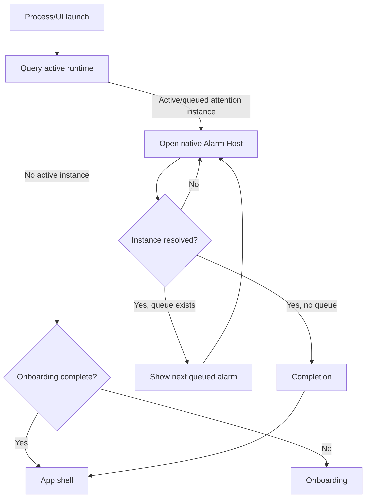
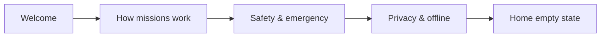
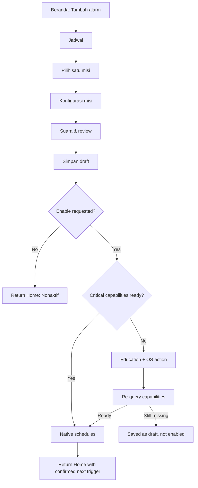
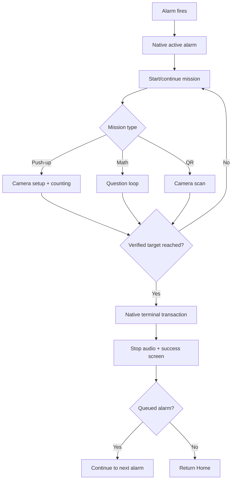
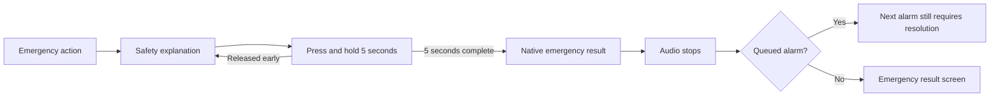

# Mission Alarm — UI/UX Specification

| Field | Value |
|---|---|
| Product | Mission Alarm |
| Document | UI/UX Specification |
| Version | 1.0 |
| Status | Accepted |
| Scope | Android MVP |
| Date | 2026-08-28 |
| Product baseline | [`../product/MVP_SCOPE.md`](../product/MVP_SCOPE.md) v1.0 Accepted |
| Technical requirements | [`../requirements/TECHNICAL_REQUIREMENTS.md`](../requirements/TECHNICAL_REQUIREMENTS.md) v1.0 Accepted |
| System architecture | [`../architecture/SYSTEM_ARCHITECTURE.md`](../architecture/SYSTEM_ARCHITECTURE.md) v1.0 Accepted |
| CV specification | [`../cv/COMPUTER_VISION_SPECIFICATION.md`](../cv/COMPUTER_VISION_SPECIFICATION.md) v1.0 Specification Accepted |
| Database design | [`../data/DATABASE_DESIGN.md`](../data/DATABASE_DESIGN.md) v1.0 Accepted |
| API contract | [`../api/API_CONTRACT.md`](../api/API_CONTRACT.md) v1.0 Accepted |

## 1. Purpose

Dokumen ini menerjemahkan baseline produk dan teknis menjadi information architecture, navigation, user flow, screen contract, interaction states, content, visual tokens, accessibility, serta adaptive-layout rules. Dokumen ini menetapkan perilaku dan struktur UI; high-fidelity visual design dan aset final dibuat setelah keputusan Fase 7 diterima.

## 2. Experience principles

1. **Alarm reliability is visible.** Pengguna dapat memahami alarm berikutnya, status aktif, dan masalah capability tanpa menebak.
2. **Mission completion is deliberate.** Tidak ada snooze, skip, atau gesture normal yang dapat melewati mission.
3. **Safety is always reachable.** Emergency dismissal selalu terlihat pada active flow, tetapi secara visual tetap sekunder dan membutuhkan hold 5 detik.
4. **Persisted truth over animation.** UI hanya menampilkan enabled, progress, atau success setelah state authoritative dikonfirmasi native core.
5. **One primary decision per screen.** Konfigurasi dibagi menjadi langkah yang ringkas; active alarm mengutamakan satu tindakan untuk melanjutkan mission.
6. **Offline and private by default.** Tidak ada account, cloud, social proof, iklan, atau copy yang menyiratkan data kamera diunggah.
7. **Accessibility is a release condition.** Seluruh critical flow harus dapat dijalankan dengan TalkBack, keyboard/switch access yang relevan, ukuran teks 200%, dan tanpa bergantung pada warna saja.

## 3. User mental model

Pengguna berinteraksi dengan tiga konsep utama:

| Concept | Meaning in UI | Source of truth |
|---|---|---|
| Alarm | Jadwal yang dapat diedit, diaktifkan, atau dinonaktifkan | `AlarmSnapshot` |
| Active alarm | Satu alarm instance yang sedang meminta perhatian; instance lain dapat mengantre | `ActiveRuntimeSnapshot` |
| History | Hasil final yang immutable: berhasil, emergency dismissed, atau system failed | `HistoryRecord` |

Istilah internal seperti occurrence, revision, outbox, digest, profile version, dan confidence tidak ditampilkan kecuali pada detail diagnostik yang aman. Copy UI menggunakan “alarm”, “misi”, “progres”, dan “riwayat”.

## 4. Information architecture

```text
App root
├── Startup gate
│   ├── Active alarm recovery → Native Alarm Host / Mission
│   ├── First-run onboarding
│   └── App shell
├── App shell
│   ├── Beranda
│   │   ├── Daftar alarm
│   │   ├── Buat/Edit alarm
│   │   │   ├── Jadwal
│   │   │   ├── Pilih misi
│   │   │   ├── Konfigurasi misi
│   │   │   ├── Pilih suara
│   │   │   └── Review & simpan
│   │   └── Riwayat terbaru
│   ├── Riwayat
│   │   └── Detail riwayat
│   └── Pengaturan
│       ├── Status izin & kesiapan
│       ├── Privasi
│       └── Tentang aplikasi
└── Native active flow (di atas semua navigasi normal)
    ├── Active alarm
    ├── Push-up mission
    ├── Math mission
    ├── QR mission
    ├── Permission/recovery state
    ├── Emergency hold
    └── Completion / next queued alarm
```

### 4.1 Primary navigation

| Window class | Navigation | Content behavior |
|---|---|---|
| Compact width `<600dp` | Bottom navigation: Beranda, Riwayat, Pengaturan | Single pane; editor/detail uses forward navigation |
| Medium width `600–839dp` | Navigation rail | List-detail may use two panes when useful |
| Expanded width `≥840dp` | Navigation rail; optional permanent label expansion | Home/history list and detail use two panes; controls retain readable max width |

`NavigationSuiteScaffold` or equivalent adaptive primitive memilih navigation presentation saat runtime. Layout tidak bergantung pada nama perangkat atau orientation saja. Active alarm native flow tidak menampilkan app-shell navigation.

### 4.2 Back, close, and dismissal behavior

| Context | System back / gesture | Explicit close |
|---|---|---|
| Onboarding | Kembali ke halaman sebelumnya; keluar aplikasi dari halaman pertama | “Lewati” hanya untuk halaman edukasi, bukan requirement setup |
| Editor | Kembali satu langkah; konfirmasi bila ada perubahan belum disimpan | “Batal” kembali tanpa mutation |
| Permission education | Kembali ke editor/active recovery tanpa menganggap izin tersedia | “Nanti” hanya untuk draft configuration |
| Active alarm/mission | Tidak menghentikan audio dan tidak menutup instance; kembali ke active-alarm hub bila aman | Tidak ada close biasa |
| Emergency hold | Release/back membatalkan hold sebelum 5 detik | Tidak ada tap-to-confirm |
| Completion | Kembali ke Beranda atau lanjut ke queued alarm | Tombol eksplisit sesuai state |

## 5. Startup and navigation state machine



Startup never routes directly to Home until native core reports that no instance requires attention. A loading surface is allowed while querying, but it must not expose normal alarm controls prematurely.

## 6. Core user flows

### 6.1 First run



- Maksimum empat short pages; setiap page mempunyai title, illustration/icon, body, dan one primary action.
- Permission tidak diminta sekaligus saat onboarding. Prompt muncul just-in-time saat user mengaktifkan alarm atau memilih mission kamera.
- Onboarding menyebutkan bahwa emergency dismissal menghasilkan status khusus, bukan keberhasilan.

### 6.2 Create and enable alarm



Save dan enable adalah hasil berbeda. UI tidak boleh menampilkan alarm sebagai aktif sampai command ack berhasil dan fresh snapshot mengonfirmasi state tersebut.

### 6.3 Trigger, mission, and completion



### 6.4 Emergency dismissal



Hold progress harus berasal dari trusted native UI clock. Accessibility alternative tetap merupakan sustained activation, bukan single tap.

## 7. Screen inventory and contracts

### 7.1 Global state vocabulary

Setiap data-backed screen mendukung state berikut:

| State | Presentation | Allowed action |
|---|---|---|
| Loading | Skeleton/progress tanpa fake data | Wait; back bila aman |
| Content | Latest authoritative snapshot | Contextual actions |
| Empty | Explanation + one useful action | Create/return |
| Recoverable error | Plain-language cause + recovery | Retry/settings/emergency when active |
| Conflict/stale | “Data alarm telah berubah” | Re-query; do not auto-merge |
| Terminal error | Safe non-success explanation | Return/Home or emergency if instance active |
| Offline | Tidak ditampilkan sebagai error; MVP normally works offline | Normal use |

### 7.2 Screen matrix

| ID | Screen | Owner | Primary action | Critical states |
|---|---|---|---|---|
| UX-01 | Startup recovery | Native + RN bootstrap | Route safely | loading, active found, none, storage error |
| UX-02 | Onboarding | RN | Lanjut/Mulai | first page, final page |
| UX-03 | Beranda | RN | Tambah alarm | empty, alarm list, capability warning, load error |
| UX-04 | Alarm editor | RN | Simpan | new/edit, dirty, validation, revision conflict |
| UX-05 | Mission picker | RN | Pilih misi | Push-up, Math, QR |
| UX-06 | Push-up setup | RN → native test | Simpan konfigurasi | guide, target, camera permission, test result |
| UX-07 | Math setup | RN | Simpan konfigurasi | target count, preview |
| UX-08 | QR registration | RN → native | Daftarkan QR | unregistered, scanning, registered, replace |
| UX-09 | Sound picker | RN | Pilih suara | playing preview, unavailable resource |
| UX-10 | Capability recovery | RN/native | Izinkan/Buka pengaturan | rationale, denied, permanently denied, restored |
| UX-11 | Active alarm | Native | Mulai/Lanjutkan misi | ringing, resumed, queued count, recovery |
| UX-12 | Push-up mission | Native | Perform push-ups | setup, tracking, correction, temporary lost, error |
| UX-13 | Math mission | RN presentation inside native Alarm Host | Jawab | question, incorrect, correct/progress, error |
| UX-14 | QR mission | Native | Scan registered QR | searching, wrong QR, success, camera error |
| UX-15 | Emergency hold | Native | Hold 5 seconds | idle, holding, canceled, complete |
| UX-16 | Result | Native/RN handoff | Selesai/Lanjut alarm berikutnya | success, emergency, system failed, queued |
| UX-17 | Riwayat list | RN | Buka detail | empty, paginated list, load error |
| UX-18 | Riwayat detail | RN | Kembali | success/emergency/system failure snapshot |
| UX-19 | Pengaturan | RN | Resolve capability | ready/degraded, privacy/about |

## 8. Detailed screen specifications

### UX-01 — Startup recovery

- Neutral branded surface with indeterminate progress and text “Memeriksa alarm aktif…”.
- Bila query melebihi 2 detik, tampilkan secondary text “Menyiapkan status alarm dengan aman.”
- Storage error tidak membuka Home. Bila native mendeteksi active side effect, route ke safe active recovery dengan emergency available.
- No promotional carousel, permission prompt, or navigation flash before routing completes.

### UX-02 — Onboarding

Pages:

1. **Bangun dengan misi** — alarm berhenti setelah satu misi selesai.
2. **Tiga pilihan misi** — push-up, matematika, atau QR; satu misi per alarm.
3. **Keselamatan tetap utama** — emergency dismissal tersedia dengan tahan 5 detik.
4. **Privat dan offline** — pemrosesan kamera dan riwayat berada di perangkat.

Primary copy on final page: “Mulai atur alarm”. Onboarding completion is persisted only after the final action.

### UX-03 — Beranda

Content order:

1. Top app bar: “Mission Alarm”.
2. Capability banner only when action is needed.
3. Next-alarm card, or “Belum ada alarm aktif”.
4. Alarm list sorted by next trigger, then creation order.
5. Recent history, maximum five items, with “Lihat semua”.
6. Prominent “Tambah alarm” FAB/button.

Each alarm row contains time, label, repeat summary, mission icon+text, next occurrence, and switch. Switch mutation shows inline progress; on failure it returns to authoritative state and explains why. Swipe-to-delete is not the only delete path; explicit overflow action exists.

Empty copy: “Belum ada alarm. Buat alarm pertama dan pilih misi untuk mematikannya.”

### UX-04 — Alarm editor

Editor is a guided vertical flow with a persistent bottom action area:

| Section | Fields/rules |
|---|---|
| Time | Required local time picker |
| Schedule | Sekali or weekly; weekly requires at least one selected day |
| Label | Optional, single line, validated length |
| Mission | Exactly one; opens UX-05 and configuration |
| Sound | One packaged sound; preview can be stopped |
| Status | New alarm defaults to draft/off until explicitly enabled |

Primary action is “Simpan alarm”; optional checked control “Aktifkan setelah disimpan” is only shown with clear capability consequences. Delete is destructive, placed in overflow or bottom danger section on edit, and requires confirmation naming the alarm. Active alarm configuration cannot be deleted until its active instance resolves.

Dirty-exit dialog: “Buang perubahan alarm?” Actions “Lanjut mengedit” and “Buang perubahan”.

### UX-05 — Mission picker

Three mutually exclusive cards:

| Mission | Summary | Setup signal |
|---|---|---|
| Push-up | Kamera menghitung repetisi yang tervalidasi | Kamera; ruang untuk tampak samping |
| Math | Jawab beberapa soal aritmetika | Tanpa kamera |
| QR | Pindai QR yang sudah didaftarkan | Kamera; QR fisik tersedia |

Cards use icon, title, body, and selected radio semantics. No card claims a mission is “easy” or “hard”. Changing mission replaces its prior mission configuration only after confirmation.

### UX-06 — Push-up setup and test

- Target stepper/input: 1–50; default 10.
- Four setup cues: whole body visible, side view, stable device, sufficient light.
- Illustration is supplemental; instructions must remain understandable as text.
- “Uji posisi kamera” launches the native test path using the same verification logic without audio, instance, or history.
- Test result can be “Siap”, “Perbaiki posisi”, “Pencahayaan kurang”, “Subjek tidak terlihat penuh”, or technical recovery.
- Saving configuration does not require a successful test, but an explicit warning is shown if test has not passed.

### UX-07 — Math setup

- Number of correct answers: 1–10; default 3.
- Operations follow accepted MVP generator rules and are summarized, not freely customized.
- Static preview shows one representative question and numeric keypad including minus.
- Copy clarifies that wrong answers do not reduce completed progress and the active question cannot be skipped.

### UX-08 — QR registration

- Registration state shows “Belum ada QR” or “QR terdaftar”. Raw payload is never displayed.
- “Daftarkan QR” opens native scanner after just-in-time camera education.
- Replacing a reference requires confirmation: “Ganti QR terdaftar?”
- Success copy: “QR berhasil didaftarkan di perangkat ini.”
- UI must not offer manual payload entry, paste, history display, or export.

### UX-09 — Sound picker

- Packaged sounds are a single-select list with name and preview button.
- Only one preview plays at a time and stops on navigation away.
- Preview respects a safe preview volume policy; it does not imitate an active-alarm lock.
- Missing resource returns to current valid selection and shows actionable error.

### UX-10 — Capability education and recovery

Capability UI separates why, current state, and next action:

| Capability | User explanation | Primary action |
|---|---|---|
| Exact alarm/scheduling access | Diperlukan agar alarm dapat dijadwalkan tepat waktu | “Buka pengaturan alarm” |
| Notifications | Diperlukan agar status alarm tampil sesuai aturan Android | “Izinkan notifikasi” / settings |
| Camera | Hanya untuk Push-up/QR; diproses di perangkat | “Izinkan kamera” / settings |
| Full-screen/overlay-related access when applicable | Membantu menampilkan alarm pada kondisi yang didukung OS | “Buka pengaturan” |

After returning from OS settings, lifecycle resumes and re-queries `CapabilitySnapshot`; no success is inferred from button tap. Draft alarm remains saved when capability is missing.

### UX-11 — Active alarm hub

Visual hierarchy:

1. Current time and alarm label.
2. Mission name and persisted progress.
3. Primary action “Mulai misi” or “Lanjutkan misi”.
4. Queue message such as “2 alarm lain menunggu”, if applicable.
5. Secondary, always-visible “Darurat: hentikan alarm”.

No snooze, dismiss, close, volume-off, or Home navigation control is exposed. System back cannot terminate the instance or audio. When activity is recreated, copy and progress come from `ActiveRuntimeSnapshot`, never transient component state.

### UX-12 — Push-up mission

- Phone defaults to landscape on compact handsets when platform permits; large/resizable windows adapt without relying solely on forced orientation.
- Camera image fills safe content region; overlay shows guide frame, progress `n/target`, and one short correction cue.
- Feedback priority: safety/error > setup correction > phase cue > progress.
- Repetition is announced visually, with a short haptic/audio cue, and via accessibility only when the verified count changes.
- No skeleton landmarks, confidence percentage, raw coordinates, or camera frames are retained or shown as diagnostics.
- Temporary tracking loss preserves count and says “Posisikan tubuh kembali dalam bingkai.”
- Emergency action remains reachable without covering the guide frame.

### UX-13 — Math mission

- Large centered equation; explicit answer field; numeric keypad includes digits, backspace, and minus.
- Primary action “Jawab”. Keyboard submit maps to the same action.
- Incorrect: keep the same question, clear or select the answer based on input method, show “Belum tepat. Coba lagi.”, and preserve completed count.
- Correct: native confirms progress, then advances to the next persisted question. Avoid celebratory animation on each answer.
- Progress is expressed as “2 dari 3 soal selesai”, not percentage only.
- There is no skip or reveal-answer action.

### UX-14 — QR mission

- Camera preview with central scanning guide, torch control if supported, progress/status text, and emergency action.
- Wrong readable QR: “QR ini tidak cocok. Pindai QR yang didaftarkan.” It does not expose scanned content.
- Undetected code: neutral “Arahkan QR ke dalam bingkai”; avoid error vibration on every frame.
- Camera failure/permission loss routes to recovery while the same instance and audio remain active.

### UX-15 — Emergency hold

- Opens as a native modal/sheet over the active flow with `paneTitle` semantics.
- Warning: “Gunakan hanya jika misi tidak dapat diselesaikan. Hasil dicatat sebagai dihentikan darurat.”
- Large danger-styled control: “Tahan 5 detik untuk menghentikan alarm”.
- While pressed: radial/linear progress and text “Tetap tahan… 3 detik”. Release immediately resets to zero.
- Completion is executed only by native trusted emergency workflow; JS receives state later by re-query.
- TalkBack/Voice Access/Switch Access must expose an equivalent sustained action. A custom accessibility action may initiate an accessible native hold mode, but still requires continuous confirmation for 5 seconds and supports cancellation.

### UX-16 — Result

| Result | Title | Detail |
|---|---|---|
| `SUCCESS` | “Misi selesai” | Mission, verified progress, completion time |
| `EMERGENCY_DISMISSED` | “Alarm dihentikan darurat” | Neutral explanation; never styled as success |
| `SYSTEM_FAILED` | “Alarm berakhir karena kendala sistem” | Recovery/support message without claiming success |

If queue exists, primary action is “Lanjut ke alarm berikutnya” and the next instance remains unresolved. Otherwise use “Selesai”. No streak, points, confetti, ranking, reward, or shame copy.

### UX-17/18 — History list and detail

- List groups by date and shows time, label snapshot, mission, result label, and duration.
- Result always has icon + text, never color only.
- Pagination appends without changing previous records.
- Detail shows immutable snapshots: scheduled/triggered/completed time, mission configuration summary, outcome, and verified progress.
- QR raw payload, camera data, Math submitted answers, and CV landmarks/confidence are absent.
- No edit/delete actions in MVP.

### UX-19 — Settings

Sections:

1. **Kesiapan alarm:** current capability health and direct recovery actions.
2. **Privasi:** concise on-device camera/QR/history explanation.
3. **Tentang:** app version, open-source notices, and support diagnostics policy.

Settings does not include account, cloud backup, custom sounds, gamification, statistics, or appearance customization in MVP. Normal surfaces follow system light/dark theme.

## 9. Low-fidelity wireframes

Wireframes communicate hierarchy, not exact visual styling.

### 9.1 Home — compact portrait

```text
┌──────────────────────────────┐
│ Mission Alarm                │
│ ┌──────────────────────────┐ │
│ │ Alarm berikutnya         │ │
│ │ 06:30 · Besok            │ │
│ │ Pagi kerja · 10 Push-up  │ │
│ └──────────────────────────┘ │
│ Alarm                        │
│ 06:30  Pagi kerja      [ON]  │
│ Sen–Jum · Push-up            │
│ 07:15  Akhir pekan     [OFF] │
│ Sab–Min · Math               │
│                              │
│ Riwayat terbaru   Lihat semua│
│ ✓ Hari ini 06:41 · Push-up   │
│                              │
│                 (+) Alarm    │
├──────────────────────────────┤
│ Beranda    Riwayat   Setelan │
└──────────────────────────────┘
```

### 9.2 Alarm editor

```text
┌──────────────────────────────┐
│ ‹  Buat alarm                │
│                              │
│            06:30             │
│ Jadwal     Sen Sel Rab Kam...│
│ Label      Pagi kerja        │
│ Misi       Push-up · 10      │
│ Suara      Fajar             │
│                              │
│ □ Aktifkan setelah disimpan  │
│ ┌──────────────────────────┐ │
│ │       Simpan alarm       │ │
│ └──────────────────────────┘ │
└──────────────────────────────┘
```

### 9.3 Active alarm

```text
┌──────────────────────────────┐
│            06:30             │
│          Pagi kerja          │
│                              │
│          PUSH-UP             │
│         0 dari 10            │
│                              │
│ ┌──────────────────────────┐ │
│ │        Mulai misi        │ │
│ └──────────────────────────┘ │
│                              │
│ Darurat: hentikan alarm      │
└──────────────────────────────┘
```

### 9.4 Push-up mission — landscape

```text
┌─────────────────────────────────────────────────────┐
│ 3 / 10                 Seluruh tubuh harus terlihat │
│ ┌───────────────────────────────────┐ ┌────────────┐ │
│ │                                   │ │ PERBAIKI   │ │
│ │        camera + body guide        │ │ Kaki belum │ │
│ │                                   │ │ terlihat   │ │
│ └───────────────────────────────────┘ │            │ │
│                                       │ Darurat    │ │
│                                       └────────────┘ │
└─────────────────────────────────────────────────────┘
```

### 9.5 Math mission and emergency hold

```text
┌──────────────────────────────┐  ┌──────────────────────────────┐
│ 2 dari 3 soal selesai        │  │ Hentikan alarm darurat?      │
│                              │  │ Gunakan hanya jika misi      │
│          18 − 27             │  │ tidak dapat diselesaikan.    │
│        [      −9 ]           │  │                              │
│                              │  │ ┌──────────────────────────┐ │
│       1  2  3                │  │ │ TAHAN 5 DETIK            │ │
│       4  5  6                │  │ │ ███████░░░  3 detik      │ │
│       7  8  9                │  │ └──────────────────────────┘ │
│       −  0  ⌫                │  │ Lepaskan untuk membatalkan   │
│ [           Jawab          ] │  │                              │
│ Darurat: hentikan alarm      │  │ Batal                        │
└──────────────────────────────┘  └──────────────────────────────┘
```

## 10. Visual system

### 10.1 Color roles

Colors below are implementation starting tokens and must pass final contrast validation in every used pairing.

| Role | Light | Dark | Use |
|---|---|---|---|
| Background | `#F8FAFC` | `#07111F` | App canvas |
| Surface | `#FFFFFF` | `#111C2E` | Cards/sheets |
| Primary | `#0369A1` | `#38BDF8` | Primary action/focus |
| On primary | `#FFFFFF` | `#082F49` | Text/icon on primary |
| Text primary | `#0F172A` | `#F8FAFC` | Main text |
| Text secondary | `#475569` | `#CBD5E1` | Supporting text |
| Success | `#166534` | `#4ADE80` | Success plus icon/text |
| Warning | `#92400E` | `#FBBF24` | Capability/recovery |
| Danger | `#B91C1C` | `#F87171` | Emergency/destructive action |
| Outline | `#94A3B8` | `#64748B` | Borders/dividers |

Normal text below 18sp (or bold below 14sp) requires at least 4.5:1 contrast; larger text requires at least 3:1. Selected, warning, success, and error state must always include text/icon/shape in addition to color.

### 10.2 Typography

Use Android system/Roboto family with `sp`, system font scaling, natural wrapping, and no fixed-height text containers.

| Token | Base size | Typical use |
|---|---:|---|
| `displayTime` | 56sp | Active alarm time |
| `display` | 36sp | Editor time / mission equation |
| `titleLarge` | 24sp | Screen title |
| `titleMedium` | 20sp | Section/card title |
| `bodyLarge` | 16sp | Primary body and controls |
| `bodyMedium` | 14sp | Supporting copy |
| `label` | 14sp | Buttons/navigation |
| `caption` | 12sp | Non-critical metadata only |

At 200% system font scale, content reflows vertically, actions remain reachable, no critical text truncates, and horizontal scrolling is not required for reading.

### 10.3 Spacing, shape, and target size

- Base spacing: 4, 8, 12, 16, 24, and 32dp.
- Screen horizontal padding: 16dp compact; 24dp medium; adaptive centered content max width 720dp for forms.
- Card radius: 16dp; control radius: 12dp; no shape alone communicates state.
- Every interactive focus area is at least 48×48dp; primary active-flow controls target 56dp minimum height.
- Adjacent destructive and primary controls maintain at least 8dp separation and distinct labels.
- Draw edge-to-edge where appropriate, but never place interaction under gesture/navigation insets.

### 10.4 Theme and elevation

- Normal app follows system light/dark theme.
- Active alarm uses a dark-first high-contrast palette to reduce glare, while still honoring contrast and system accessibility settings.
- Surface hierarchy uses tonal separation and minimal elevation; no essential meaning depends on shadows.

## 11. Motion, sound, and haptics

| Feedback | Rule |
|---|---|
| Navigation motion | 150–300ms, preserves spatial direction, reduced/removed when reduced motion is requested |
| Progress update | Subtle number/indicator transition; no continuous pulsing |
| Incorrect Math/QR | Short haptic + text; no aggressive shake loop |
| Verified push-up | One concise haptic/audio cue per persisted count |
| Emergency hold | Continuous visual progress; optional escalating haptic ticks, never audio-only |
| Success | Brief confirmation; no confetti/gamification |

Alarm audio is a system behavior, not decorative UI feedback. Visual and accessibility equivalents accompany all non-alarm sound/haptic cues.

## 12. Accessibility specification

### 12.1 Semantics and navigation

- All interactive elements expose role, concise label, current state, and action; decorative icons use null/hidden semantics.
- Reading order follows title → critical state → progress/content → primary action → emergency action.
- Custom camera overlays expose meaningful summary text instead of every drawn marker.
- Modal/sheet uses a pane title and moves focus to its heading; closing restores focus to the invoking control.
- Error announcements use polite live regions. Assertive announcements are reserved for a truly time-critical state; countdowns/frame feedback must not announce continuously.
- Switches announce alarm label and enabled state, e.g. “Pagi kerja, alarm nonaktif, sakelar”.

### 12.2 Alternative input

- Every flow is operable with TalkBack and Switch/Voice Access where Android supports it.
- Gesture-only operations have a visible control and accessibility custom action.
- Hardware keyboard/D-pad focus is visible and ordered; Enter/Space activates the focused standard action.
- Camera mission instructions must be available as spoken text, although physical camera placement and exercise remain inherent mission requirements.
- Emergency mechanism has a tested accessible sustained-confirmation path; accessibility must not reduce it to an accidental single activation.

### 12.3 Scaling and layout

- Validate at default and 200% font scale, display-size enlargement, portrait/landscape, and compact/medium/expanded widths.
- Text wraps; critical action areas remain on screen through scrolling/sticky safe action placement.
- Do not lock the app globally to portrait. Push-up presentation prefers landscape on compact phones but remains usable in resizable and large-screen contexts.

### 12.4 Accessibility release checks

1. Android Studio Compose UI Check has no unresolved critical issue.
2. Accessibility Scanner has no critical touch-target, label, or contrast issue in core flows.
3. Manual TalkBack run completes create/enable alarm, Math mission, QR recovery, emergency hold, and history inspection.
4. Semantics UI tests cover role/state/action and progress announcements.
5. Physical-device testing validates alarm audio plus TalkBack coexistence and camera instructions.

## 13. Responsive and configuration behavior

| Surface | Compact | Medium/Expanded |
|---|---|---|
| Home | Single list | Alarm list plus supporting next/recent pane |
| Editor | Single scrolling column | Centered form; optional review pane |
| History | List then detail | List-detail panes |
| Settings | Single list | List-detail/supporting pane |
| Active alarm | Centered single focus | Centered content with bounded max width |
| Push-up | Landscape camera-first | Camera and feedback supporting pane; handle resize/posture dynamically |
| Math | Centered question/keypad | Question and keypad remain bounded, never stretched full width |

Window class changes preserve route, editor draft, focus when feasible, and native persisted mission progress. Insets, cutouts, hinge/posture, and multi-window changes must not obscure controls.

## 14. Content design

### 14.1 Language

- MVP default copy is Bahasa Indonesia; all strings are externalized for future localization.
- Use direct verbs: “Simpan alarm”, “Izinkan kamera”, “Coba lagi”.
- Avoid blame/shame: use “Belum tepat” rather than “Kamu salah”.
- Avoid unsupported guarantees: say “Diperlukan agar alarm dapat dijadwalkan tepat waktu”, not “Alarm pasti selalu berbunyi”.
- Time/day formatting follows device locale and 12/24-hour preference.

### 14.2 Error mapping examples

| Stable condition | User-facing copy | Action |
|---|---|---|
| Capability missing | “Alarm tersimpan, tetapi belum aktif karena izin penjadwalan diperlukan.” | “Buka pengaturan” |
| Camera denied | “Kamera diperlukan untuk misi ini. Pemrosesan dilakukan di perangkat.” | “Izinkan kamera” |
| Revision conflict | “Alarm ini berubah sejak terakhir dibuka.” | “Muat ulang” |
| Camera unavailable | “Kamera belum dapat digunakan. Tutup aplikasi kamera lain lalu coba lagi.” | “Coba lagi” + emergency if active |
| Storage unavailable | “Status belum dapat disimpan dengan aman.” | “Coba lagi” + emergency if active |
| Wrong QR | “QR ini tidak cocok. Pindai QR yang didaftarkan.” | Continue scanning |
| Tracking lost | “Posisikan tubuh kembali dalam bingkai.” | Continue mission |

Native stable error codes are mapped to localized copy in the UI layer. Raw exception, stack trace, raw QR value, confidence score, or database terminology never appears to the user.

## 15. Privacy and safety presentation

- Camera education states what is processed, why it is required, and that raw frames are not stored by the MVP.
- QR presentation never reveals, copies, logs, or exports the payload.
- History exposes only approved immutable summaries.
- Push-up setup includes safe-space and stable-device guidance; it does not make health or medical claims.
- Emergency action is continuously visible in active flows and remains available during permission, camera, CV, storage-recovery, or configuration errors.
- Marketing or onboarding must not imply the app can override all OEM/battery/platform restrictions.

## 16. Analytics and telemetry boundary

MVP has no account, backend analytics, ad SDK, or remote telemetry. UX measurement during development uses test instrumentation and manually reviewed, sanitized local diagnostics only. Screen specifications must not introduce consent banners for nonexistent tracking.

## 17. UI/native boundary

| Concern | RN UI | Native trusted UI/core |
|---|---|---|
| Home/editor/history/settings | Renders DTO snapshots and issues typed commands | Validates, persists, schedules, returns ack/snapshot |
| Optimistic visual feedback | May show pending only | Determines final state/revision |
| Active alarm host | May receive invalidation after completion | Owns launch, audio, lock, lifecycle, recovery |
| Push-up/QR camera | Configuration entry only | Owns camera, verification, progress, terminal result |
| Math active mission | Renders mission presentation inside native Alarm Host and submits typed answers | Owns question/progress validation, persisted state, emergency shell, and terminal result |
| Emergency hold | No command surface | Fully native trusted UI and completion path |

Events are invalidation hints. After an event, resume, OS settings return, or native activity completion, RN re-queries the relevant snapshot before rendering authoritative state.

## 18. Traceability

| Requirement group | UX realization |
|---|---|
| AC-ALM / TR-ALM | UX-03/04/09/10, draft-vs-enable feedback, confirmed next trigger |
| AC-DIS / TR-INV-001–002 | UX-11/15, no normal dismiss, native hold 5 seconds |
| AC-PUP / TR-PUP | UX-06/12, test path, side view, validated persisted progress |
| AC-MTH / TR-MTH | UX-07/13, persisted question loop, signed numeric input, no skip |
| AC-QR / TR-QR | UX-08/14, device registration, no raw payload, mismatch recovery |
| TR-MIS-004–008 | Global persisted snapshot states, recovery copy, no error-to-success |
| TR-OVR | Active hub/result queue count and explicit next-instance flow |
| AC-HIS / TR-DAT | UX-17/18 immutable local history and privacy exclusions |
| API contract | Pending/ack/re-query pattern, revision conflict, stable error mapping |
| CV specification | UX-06/12 feedback taxonomy, no raw CV data, physical-device gates |

## 19. UX acceptance gates for Phase 7

- Information architecture covers every accepted MVP screen and excludes out-of-scope features.
- Startup and resume prioritize unresolved active alarm before normal navigation.
- Every mission has configuration, runtime, error, recovery, completion, and emergency states.
- UI cannot infer success, enabled state, or persisted progress optimistically.
- Emergency dismissal is native, visible, distinguishable from success, and requires hold 5 seconds.
- Overlap queue behavior is understandable and never dismisses queued alarms implicitly.
- Permission education is just-in-time and re-checks OS state after return.
- Adaptive layouts cover compact, medium, and expanded widths without device-name branching.
- Accessibility covers 48dp targets, contrast, TalkBack semantics, alternative actions, and 200% font scaling.
- Privacy copy and visual surfaces expose no raw QR, camera frame, landmarks, submitted Math answers, or sensitive diagnostics.

## 20. Accepted UX decision record

Seluruh keputusan berikut disetujui product owner pada 2026-08-29.

| ID | Accepted decision | Impact/trade-off |
|---|---|---|
| UX-ADR-001 | App shell memakai tiga destination: Beranda, Riwayat, Pengaturan; compact memakai bottom navigation dan layar lebih lebar memakai rail. | Familiar dan adaptive; tidak ada dedicated mission tab. |
| UX-ADR-002 | Startup/resume selalu memeriksa active runtime dan active alarm mengambil prioritas atas onboarding/Home. | Menjaga lock/recovery; startup membutuhkan native query gate. |
| UX-ADR-003 | Alarm editor memakai guided single flow dan alarm baru default sebagai draft/nonaktif sampai enable eksplisit berhasil. | Mengurangi accidental scheduling; menambah satu keputusan enable. |
| UX-ADR-004 | Permission diminta just-in-time dan selalu diverifikasi ulang setelah kembali dari OS settings. | Lebih jelas/privat; setup dapat memiliki recovery step tambahan. |
| UX-ADR-005 | Active alarm adalah native dark-first surface tanpa normal dismiss, snooze, atau app-shell navigation. | Fokus dan reliable; memerlukan visual system native yang konsisten. |
| UX-ADR-006 | Emergency action selalu terlihat tetapi sekunder, lalu membuka native sustained hold 5 detik dengan accessible equivalent. | Safety reachable dan tahan accidental tap; membutuhkan accessibility testing khusus. |
| UX-ADR-007 | Push-up runtime memilih camera-first landscape pada compact phone, sedangkan surface lain dan large/resizable windows beradaptasi dari window class. | Framing lebih baik; resize/orientation testing bertambah. |
| UX-ADR-008 | UI hanya mengubah durable status setelah ack dan fresh authoritative snapshot; pending state boleh ditampilkan. | Tidak ada false success/enabled; beberapa action membutuhkan re-query. |
| UX-ADR-009 | Normal UI mengikuti system theme; active flow dark-first dengan contrast tervalidasi. | Nyaman untuk alarm malam; token harus tersedia di RN dan native. |
| UX-ADR-010 | Copy MVP default Bahasa Indonesia, seluruh string externalized, dan format waktu mengikuti device locale/preference. | Cocok untuk target awal dan siap dilokalkan; butuh string catalog sejak awal. |
| UX-ADR-011 | Result bersifat faktual tanpa poin, streak, confetti, reward, atau shame language. | Konsisten dengan scope; motivasi gamification ditunda. |
| UX-ADR-012 | TalkBack, 48dp target, contrast, 200% font scale, dan accessible emergency path menjadi release gates. | Inklusif dan testable; menambah test matrix serta implementation effort. |

## 21. Phase 8 handoff

Setelah UX decisions diterima, Testing Strategy harus menurunkan:

- navigation and state-transition UI tests;
- screenshot/golden matrix for themes, font scales, and window classes;
- TalkBack, Switch Access, keyboard/D-pad, and Accessibility Scanner checks;
- end-to-end active alarm, process death, permission recovery, and overlap queue flows;
- native/RN contract-state tests for pending, ack, re-query, stale revision, and error mapping;
- physical-device camera usability and emergency reachability scenarios.

## 22. Primary references

- [Android Developers — Make apps more accessible](https://developer.android.com/guide/topics/ui/accessibility/apps)
- [Android Developers — Semantics in Jetpack Compose](https://developer.android.com/develop/ui/compose/accessibility/semantics)
- [Android Developers — Test your app's accessibility](https://developer.android.com/guide/topics/ui/accessibility/testing)
- [Android Developers — Use window size classes](https://developer.android.com/develop/adaptive-apps/guides/use-window-size-classes)
- [Android Developers — Build adaptive navigation](https://developer.android.com/develop/adaptive-apps/guides/build-adaptive-navigation)
- [Android Developers — Android 14 font scaling](https://developer.android.com/about/versions/14/features#non-linear-font-scaling)
